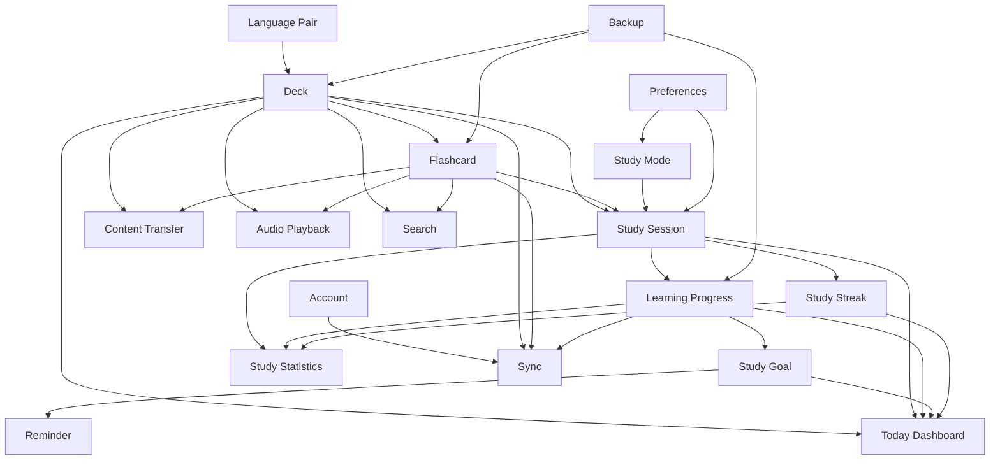

# MemoX business objects

Thư mục này tổ chức đặc tả theo core business object/aggregate và supporting business capability/projection, không theo route hoặc bảng dữ liệu. Mỗi folder sở hữu invariants/lifecycle hoặc một projection/interaction contract rõ; các màn hình chỉ tiêu thụ contract của một hoặc nhiều object.

## 1. Object catalog

| Object | Folder | Sở hữu | Không sở hữu |
| --- | --- | --- | --- |
| Deck | [deck](./deck/README.md) | Cấu trúc Empty/Leaf/Parent, hierarchy và Deck lifecycle | Nội dung Card, Study engine |
| Language Pair | [language-pair](./language-pair/README.md) | Learning/native language context và dependency của Deck | Dịch nội dung Card |
| Flashcard | [flashcard](./flashcard/README.md) | Term/meaning, translations, duplicate, move/hide/delete | Deck hierarchy, scheduling algorithm |
| Study Session | [study-session](./study-session/README.md) | Session snapshot, stage lifecycle, resume/exit/finalize | Deck mutation, long-term reporting |
| Learning Progress | [learning-progress](./learning-progress/README.md) | SRS state, attempt outcome và due scheduling | Session UI, card content |
| Study Goal | [study-goal](./study-goal/README.md) | Daily target và goal attainment | Reminder delivery, SRS due calculation |
| Reminder | [reminder](./reminder/README.md) | Reminder schedule, permission và notification lifecycle | Study goal calculation |
| Preferences | [preferences](./preferences/README.md) | Theme, study, word-display, mode và voice preferences | Account identity, Deck-specific progress |
| Account | [account](./account/README.md) | Authentication state, sync status và conflict decision | Local business data ownership |
| Backup | [backup](./backup/README.md) | Backup snapshot, compatibility, restore và recovery | Day-to-day sync |
| Content Transfer | [content-transfer](./content-transfer/README.md) | Import/export jobs, parsing, mapping, dedupe và file result | Deck target eligibility, Card editing |

## 2. Supporting business capability/projection catalog

| Object/capability | Folder | Sở hữu | Không sở hữu |
| --- | --- | --- | --- |
| Study Mode | [study-mode](./study-mode/README.md) | Mode interaction và canonical evidence | Session persistence, SRS scheduling |
| Audio Playback | [audio-playback](./audio-playback/README.md) | Player queue/control/interruption/error | Card audio asset, Study progress |
| Study Streak | [study-streak](./study-streak/README.md) | Qualified-day projection và streak boundary | Goal target, Session lifecycle |
| Study Statistics | [study-statistics](./study-statistics/README.md) | Metrics/read projections và scope | Source Session/Progress mutation |
| Search | [search](./search/README.md) | Query/ranking/filter/recent/index lifecycle | Deck/Card mutation, target eligibility |
| Today Dashboard | [today-dashboard](./today-dashboard/README.md) | Current-state orchestration và primary learning entry | Due/Goal/Streak/Session source data |

## 3. Dependency map

Mũi tên biểu thị object phía sau cần contract của object phía trước; không biểu thị ownership ngược.

## 4. Quy tắc ownership

- Một business rule chỉ có một owner file; object khác dẫn link và mô tả handoff.
- Deck quyết định target có nhận card hay không; Content Transfer quyết định source được parse/import thế nào.
- Flashcard sở hữu content và duplicate semantics; Learning Progress sở hữu scheduling state của Card.
- Study Session sở hữu snapshot/attempt flow; Learning Progress sở hữu kết quả dài hạn sau attempt.
- Account/Sync và Backup không thay thế local objects làm source of truth.
- Preferences thay đổi cách trải nghiệm hoạt động, không sửa business history đã ghi.
- Supporting projections không ghi ngược vào source objects.
- Study Mode tạo evidence; Study Session persist Attempt; Learning Progress schedule outcome.
- Today Dashboard orchestrate navigation nhưng không tự tính Due, Goal hoặc Streak.

## 5. Những phần không tạo thành object riêng

| Surface/capability | Lý do |
| --- | --- |
| Library | Collection view của Deck |
| Theme screen | UI quản lý Preferences |
| Study Result | Finalize/result surface của Study Session |
| Flashcard Editor/List | UI của Flashcard object |
| Language screen | UI của Language Pair object |
| Audio asset | Child content thuộc Flashcard; Player lifecycle thuộc Audio Playback |

Nếu một capability về sau có lifecycle/persistence/permission độc lập, có thể nâng thành object bằng ADR/business decision, không tạo folder tùy tiện.

## 6. Tiêu chuẩn tài liệu flow

`deck/create-deck.md` là chuẩn tham chiếu. Mỗi flow hoàn chỉnh tối thiểu có:

1. Phạm vi, owner và out-of-scope.
2. Nguyên tắc/invariants đã chốt.
3. Entry points và preconditions.
4. Master flow Mermaid.
5. Objective, archetype và composition khi có UI.
6. Validation/eligibility/permission decision table.
7. Idle, invalid, submitting, recoverable failure và success lifecycle.
8. Cancel/Back/draft/concurrent/offline behavior.
9. Cross-object input/output contract.
10. State matrix, action matrix và error copy.
11. Acceptance criteria có thể kiểm chứng.
12. Parity dưới 3% cho mọi canonical UI state × theme có reference.

Không tạo flow file rỗng. README của từng object là backlog/catalog; chỉ đổi trạng thái sang `Đã có` khi file đạt toàn bộ chuẩn trên.
