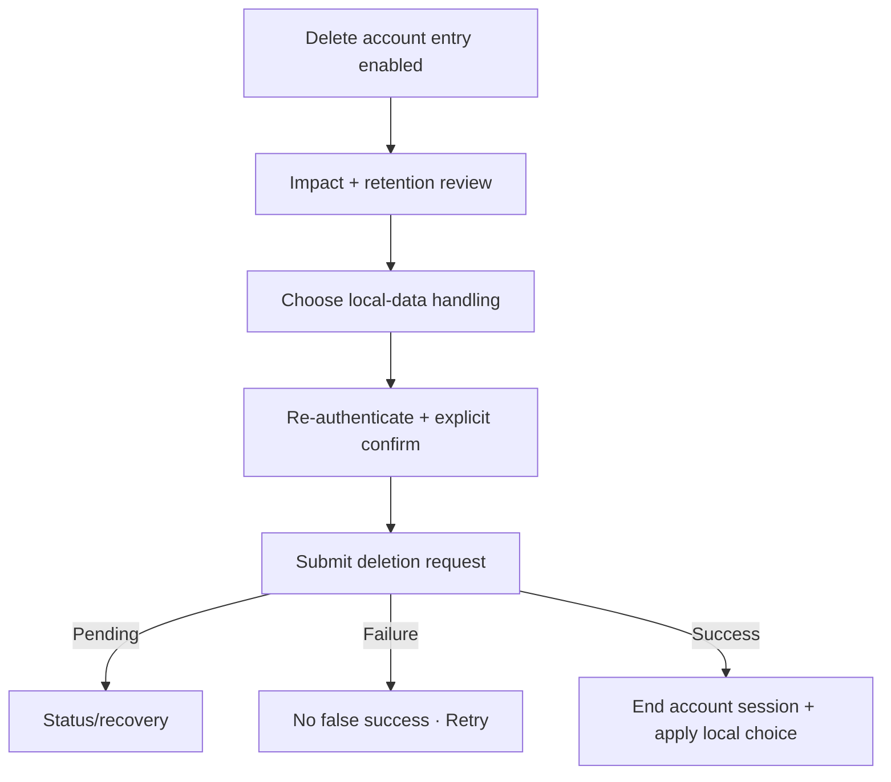

# Đặc tả quyết định UI/UX — Delete Account (Conditional)

Flow này chỉ có hiệu lực nếu sản phẩm xác nhận hỗ trợ xóa Account. Tài liệu định nghĩa guard bắt buộc; nó không tự phê duyệt feature.

## 1. Trạng thái phạm vi

- Product scope: **chưa xác nhận**.
- Không expose entry point cho đến khi policy backend, retention, legal và local-data choice được duyệt.
- Delete Account khác Sign-out và xóa local data.

## 2. Nguyên tắc bắt buộc nếu được duyệt

- Impact cloud identity/data, pending sync và retention phải hiển thị trước confirm.
- User chọn rõ giữ hay xóa local data nếu policy cho phép.
- Re-authentication gần thời điểm delete là bắt buộc.
- Request idempotent; unknown outcome phải query status trước Retry.
- Không tuyên bố hoàn tất trước khi server xác nhận terminal state.

## 3. Master flow conditional

## 4. State matrix

- Unsupported/feature hidden; eligible; re-auth required.
- Pending sync/subscription/provider restrictions nếu có.
- Confirm/cancel/submitting/pending/failure/success.
- Keep/delete local data, offline/unknown outcome.

## 5. Acceptance criteria để mở feature

- Product/legal/backend contracts đã được duyệt và traceable.
- Entry point bị ẩn khi dependency chưa sẵn sàng.
- Xóa cloud và local là hai outcomes tách biệt, audit được.
- Retry không tạo nhiều deletion requests hoặc báo success giả.
