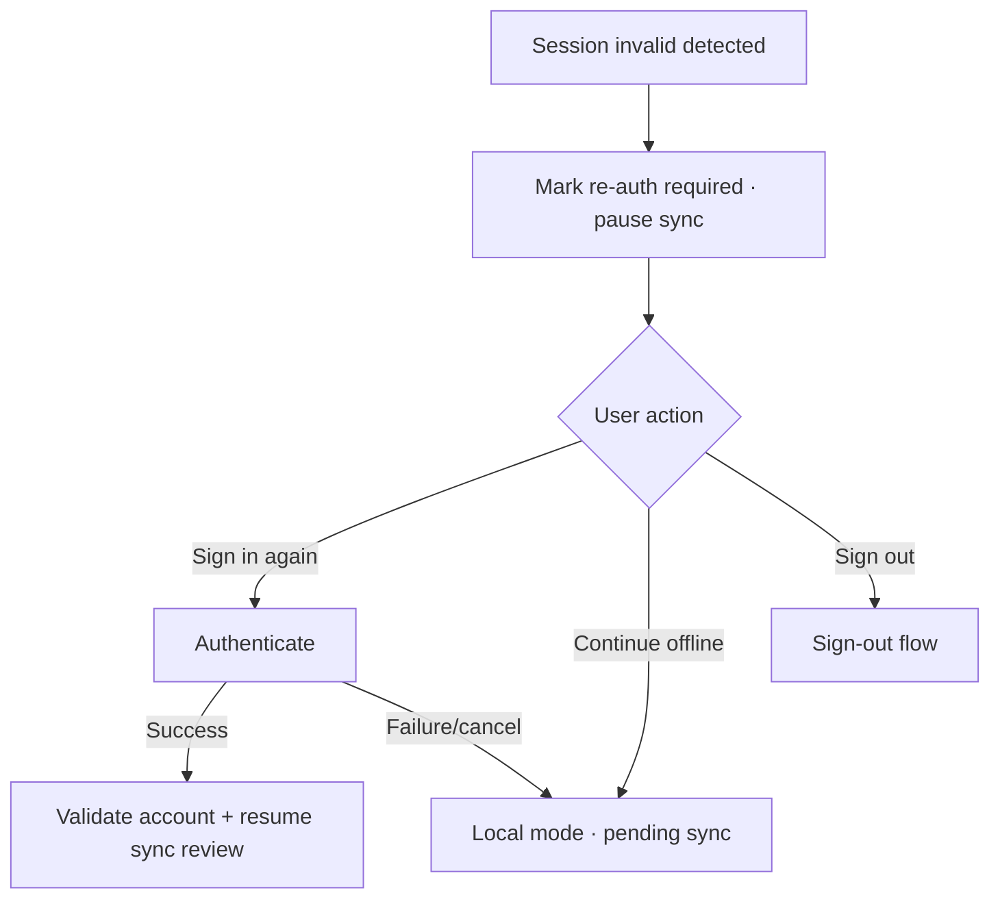

# Đặc tả UI/UX hoàn chỉnh — Recover Account Session

Flow này xử lý credential hết hạn, revoked session và re-auth trong khi vẫn cho phép tiếp tục local/offline.

## 1. Nguyên tắc đã chốt

- Auth failure không khóa local Deck/Study.
- Account-only actions bị pause cho tới re-auth.
- Re-auth không tự chạy destructive sync.
- Pending sync queue được giữ.
- Repeated auth failures không tạo prompt loop chặn app.

## 2. Master flow

## 3. Objective và composition

- Objective: khôi phục Account mà không cản việc học local.
- Archetype: Recoverable account banner/screen.
- Primary CTA `Sign in again`; `Continue offline` luôn rõ khi local mode hợp lệ.

## 4. Lifecycle

- Prompt frequency/routing có cooldown và user control.
- Re-auth callback stale/wrong account chuyển review, không apply token âm thầm.
- Success refresh account status trước sync.
- Offline state không giả success.

## 5. State matrix

- Expired/revoked/wrong-account, online/offline.
- Re-auth loading/cancel/failure/success, continue local, sign out.
- Active Study, pending sync, repeated detection.

## 6. Acceptance criteria

- Local data và Study vẫn usable.
- Sync dừng khi credentials invalid.
- Re-auth không auto-overwrite local data.
- Prompt không loop chặn user.
