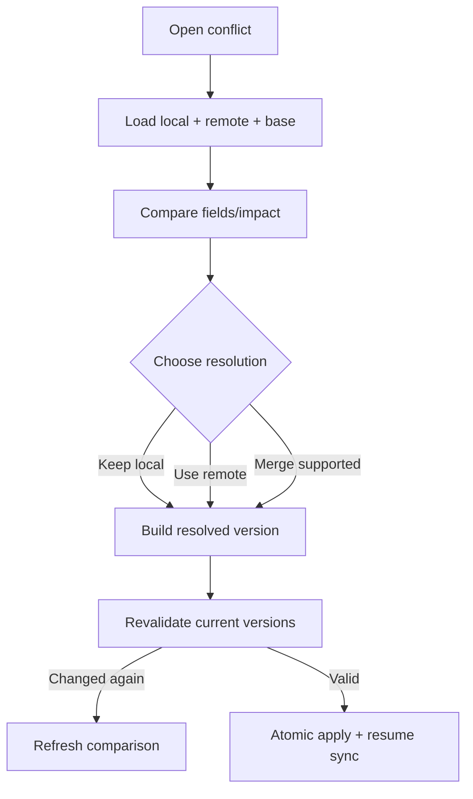

# Đặc tả UI/UX hoàn chỉnh — Resolve Sync Conflict

Flow này cho user so sánh local/remote versions, chọn hoặc merge khi object contract cho phép, rồi apply atomically.

## 1. Nguyên tắc đã chốt

- Không có default cloud-wins.
- Conflict presentation nêu object, changed fields, timestamps/version và impact.
- Merge chỉ khả dụng khi owning object có deterministic merge contract.
- Resolution revalidates remote/local versions trước commit.
- Unaffected data tiếp tục usable theo sync policy.

## 2. Master flow

## 3. Objective và composition

- Objective: giải quyết conflict mà user hiểu dữ liệu nào được giữ.
- Archetype: Compare/decision.
- Primary CTA `Apply resolution`; destructive impact có confirm bổ sung.

## 4. Lifecycle

- Draft resolution giữ khi recoverable failure.
- New remote/local version invalidates old decision trước apply.
- Apply idempotent theo conflict/resolution identity.
- Success ghi audit metadata và resume affected sync scope.

## 5. State matrix

- Field/content/hierarchy/progress/preferences conflicts.
- Keep local/remote/merge unavailable, stale conflict, apply failure.
- Large/long diff, multiple conflicts, narrow/large font/light/dark.

## 6. Acceptance criteria

- User explicit quyết định trước destructive overwrite.
- Stale versions không bị apply.
- Owning object invariants vẫn pass.
- Retry tạo một resolved version và không duplicate data.
