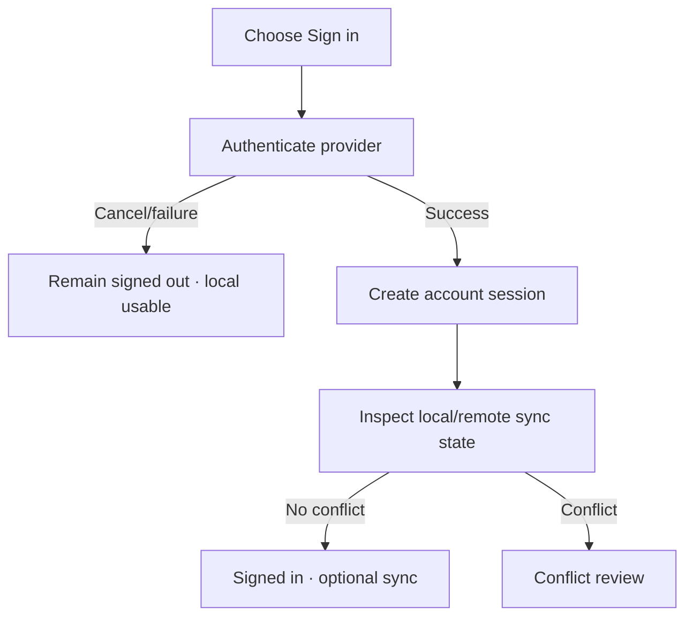

# Đặc tả UI/UX hoàn chỉnh — Sign In

Flow này xác thực Account, giữ local data an toàn và chuẩn bị sync review; nó không tự chọn cloud thắng.

## 1. Nguyên tắc đã chốt

- MemoX local vẫn usable khi signed out/offline.
- Sign-in không xóa hoặc overwrite local data.
- Credentials/token không xuất hiện trong log/copy.
- Return destination được validate; auth cancel không mất current context.
- Có local + remote data thì chuyển sync/conflict policy rõ.

## 2. Master flow

## 3. Objective và composition

- Objective: đăng nhập mà không gây mất dữ liệu local.
- Archetype: Authentication handoff.
- Primary CTA theo supported provider; privacy/supporting copy ngắn gọn.

## 4. Lifecycle

- Signing in khóa duplicate request nhưng cho system auth cancel.
- Expired/invalid callback fail closed.
- Success persist session trước navigation.
- Offline nêu tiếp tục local, không giả signed-in.

## 5. State matrix

- Signed-out, authenticating, cancel, provider/network failure.
- Success no-data/local-only/remote-only/both/conflict.
- Session callback stale, long account label, light/dark.

## 6. Acceptance criteria

- Sign-in không mutate local objects trước sync decision.
- Cancel/failure giữ app usable.
- Callback được validate và apply một lần.
- Conflict không auto-resolve cloud-wins.
