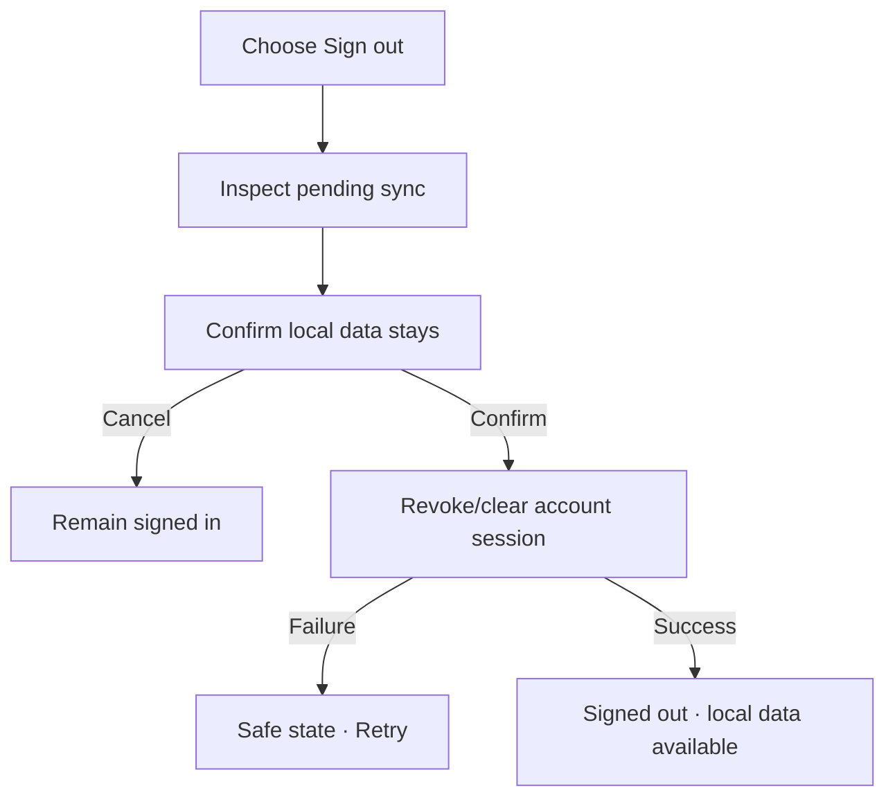

# Đặc tả UI/UX hoàn chỉnh — Sign Out

Flow này kết thúc Account session nhưng mặc định bảo toàn dữ liệu local.

## 1. Nguyên tắc đã chốt

- Sign-out khác Delete Account và không xóa local data.
- Pending sync được nêu rõ trước confirm.
- Credentials/session secret bị thu hồi/xóa theo provider policy.
- Sign-out retry idempotent.
- Offline sign-out vẫn kết thúc local account session và ghi remote-revoke pending nếu cần.

## 2. Master flow

## 3. Objective và composition

- Objective: kết thúc phiên Account mà vẫn tiếp tục dùng dữ liệu trên thiết bị.
- Archetype: Confirmation.
- Copy nêu pending changes và local preservation; `Sign out` là destructive-to-session.

## 4. Lifecycle

- Confirm locks repeated actions.
- Remote revoke failure không giữ token active local; retry bookkeeping rõ.
- Active Study/Playback không bị xóa; account-only sync dừng.
- Return về prior safe screen hoặc Account signed-out state.

## 5. State matrix

- No pending/pending sync, online/offline.
- Confirm/cancel/signing-out/failure/success.
- Expired session, active Study, long account label.

## 6. Acceptance criteria

- Local Deck/Card/Progress còn nguyên.
- Session secret không còn usable local sau success.
- Pending sync impact được trình bày.
- Double confirm không gây side effect lặp.
