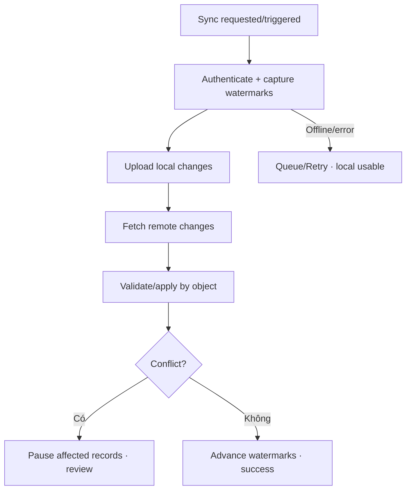

# Đặc tả UI/UX hoàn chỉnh — Sync Local Data

Flow này điều phối upload/download versioned records, progress, retry và conflict detection mà không thay quyền sở hữu của từng object.

## 1. Nguyên tắc đã chốt

- Sync operations idempotent theo record/version/event identity.
- Không duplicate Deck/Card/Attempt khi retry.
- Remote change phải qua invariant validation của object sở hữu.
- Offline giữ pending queue và local app usable.
- Conflict không được auto cloud-wins nếu policy chưa rõ.

## 2. Master flow

## 3. Sync status contract

- Signed-out, idle, syncing, success, offline, error và conflict là distinct states.
- Progress nêu phase/count nhưng không lộ content nhạy cảm.
- Partial unaffected records có thể commit chỉ theo explicit transaction policy.

## 4. Lifecycle

- Concurrent triggers coalesce.
- App background/checkpoint resume theo watermarks.
- Unknown apply outcome re-fetch version trước retry.
- Sign-out dừng job an toàn, không xóa pending local changes.

## 5. State matrix

- Local-only/remote-only/both, first/incremental sync.
- Offline, auth expiry, network/storage/object validation error.
- Conflict, large data, interrupted/retry/concurrent trigger.

## 6. Acceptance criteria

- Retry không duplicate records/history.
- Invalid remote object không phá local invariant.
- Watermark chỉ advance sau committed apply.
- UI phân biệt offline/error/conflict.
