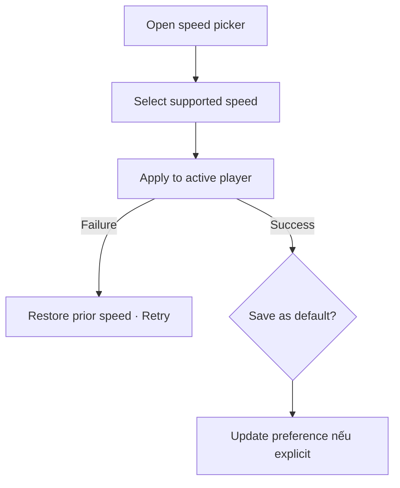

# Đặc tả UI/UX hoàn chỉnh — Change Playback Speed

Flow này thay đổi tốc độ phát hiệu lực của playback session và tùy policy có thể lưu làm preference mặc định.

## 1. Nguyên tắc đã chốt

- Chỉ chọn speed trong supported set.
- Đổi speed không đổi current item hoặc reset position.
- Session speed và saved default là hai quyết định tách biệt.
- Unsupported persisted speed fallback về default an toàn.
- Audio asset gốc không bị rewrite.

## 2. Master flow

## 3. Objective và composition

- Objective: nghe ở tốc độ phù hợp mà không gián đoạn vị trí.
- Archetype: Single-selection sheet.
- Selected speed có text/checkmark; dismiss không thay đổi nếu chưa chọn.

## 4. Lifecycle

- Apply optimistic chỉ khi player hỗ trợ rollback chắc chắn; nếu không dùng confirmed state.
- Failure giữ picker và prior speed.
- Save default failure không rollback active session speed, nhưng báo rõ.
- Resume dùng session speed snapshot; session mới đọc preference mới.

## 5. State matrix

- Default/custom, picker open, applying, failure, unsupported fallback.
- Background/resume, large font, narrow, light/dark.

## 6. Acceptance criteria

- Position/current item giữ nguyên khi đổi speed.
- Chỉ supported speed được apply.
- Lưu default cần hành động explicit.
- Failure không để label và actual speed khác nhau.
