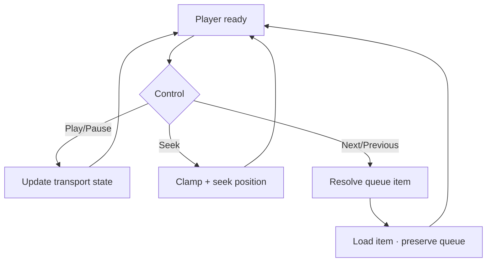

# Đặc tả UI/UX hoàn chỉnh — Control Deck Playback

Flow này sở hữu play, pause, seek, next, previous và hiển thị vị trí hiện tại trong queue snapshot.

## 1. Nguyên tắc đã chốt

- Controls tác động playback position, không tác động Learning Progress.
- Next/Previous không vượt queue bounds.
- Seek chỉ khả dụng khi media item hỗ trợ duration/seek.
- Control lặp nhanh được serialize; UI phản ánh confirmed player state.
- Touch target tối thiểu 44×44 và có accessible label.

## 2. Master flow

## 3. Composition

- Current Card context, elapsed/duration và queue position.
- Primary control: Play/Pause; supporting: Previous, Next, seek bar, speed.
- Disabled state rõ tại queue boundaries hoặc unknown duration.

## 4. Lifecycle và errors

- Loading item giữ controls phù hợp disabled.
- Seek/load failure quay về last confirmed position hoặc recovery flow.
- App background persist current item + position theo policy.
- Queue item bị xóa sau snapshot vẫn xử lý qua asset error, không mutate queue âm thầm.

## 5. State matrix

- Playing, paused, buffering, seeking, first/middle/last item.
- Unknown duration, rapid controls, item load failure.
- Lock/background, large font, narrow, light/dark.

## 6. Acceptance criteria

- UI và player state không diverge sau control failure.
- Bounds và seek được clamp an toàn.
- Controls không phát Study Attempt/Goal contribution.
- Resume mở đúng item và confirmed position.
