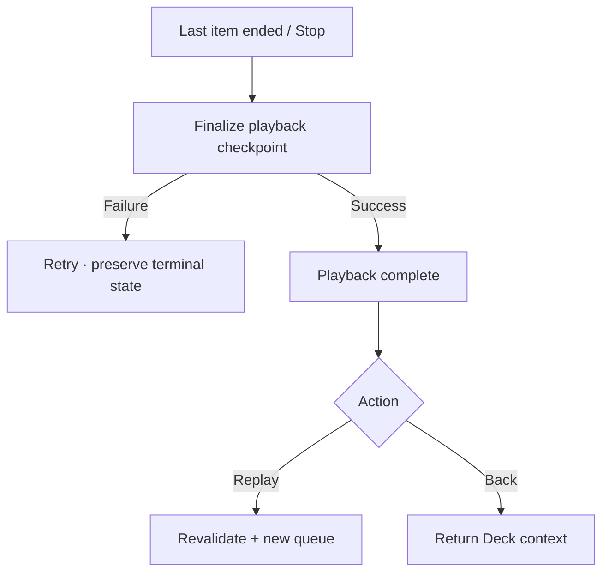

# Đặc tả UI/UX hoàn chỉnh — Finish Deck Playback

Flow này kết thúc playback tự nhiên hoặc theo user action và cung cấp Replay/Back mà không giả lập Study completion.

## 1. Nguyên tắc đã chốt

- End tự nhiên chỉ khi queue đã tới terminal state.
- User Stop xác nhận khi mất vị trí chưa hoàn tất theo policy.
- Finish persist terminal checkpoint idempotently.
- Replay tạo playback run mới từ scope hiện hành đã revalidate.
- Không tạo Attempt, Goal hay Streak contribution.

## 2. Master flow

## 3. Objective và composition

- Objective: đóng Player rõ ràng và chọn hành động tiếp theo.
- Archetype: Completion summary.
- Primary CTA: `Replay` hoặc `Back to deck` theo entry context; chỉ một CTA primary.
- Summary có played/skipped count và issues nếu có.

## 4. Lifecycle

- Finalizing disable repeat Back/Replay.
- Failure không phát completion screen giả; Retry cùng finish identity.
- Back restore originating Deck/path nếu còn tồn tại, nếu không về Library.
- Replay không reuse stale audio refs.

## 5. State matrix

- Natural end, user stop, skipped items, all-items-failed.
- Finalizing/failure/success, Replay empty-after-revalidation.
- Large counts/text, large font, narrow, light/dark.

## 6. Acceptance criteria

- Finish idempotent và queue terminal được ghi một lần.
- Completion không ảnh hưởng dữ liệu học.
- Replay revalidate scope và audio.
- Back destination an toàn khi Deck đã đổi/xóa.
