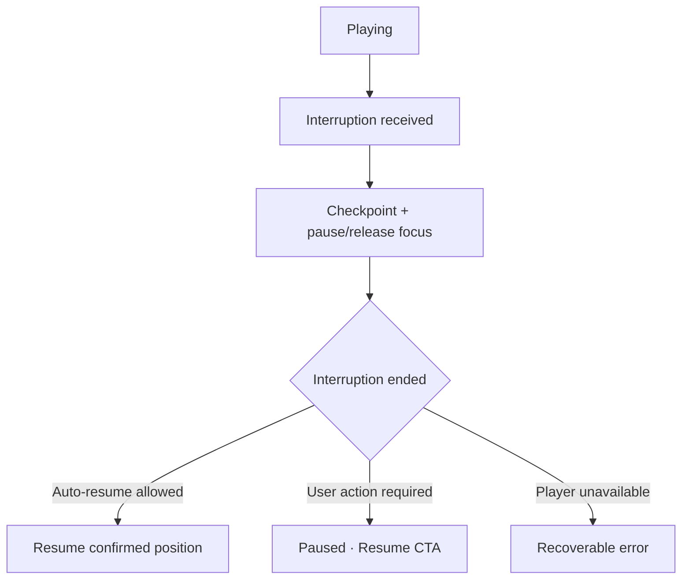

# Đặc tả UI/UX hoàn chỉnh — Handle Audio Interruption

Flow này xử lý call, audio focus, headphone disconnect, background và resume mà không mất playback checkpoint.

## 1. Nguyên tắc đã chốt

- Interruption luôn checkpoint item, position và prior transport state.
- Headphone disconnect/call không auto-resume nếu platform policy yêu cầu user action.
- Background không được đánh dấu Player finished.
- Nhiều interruption liên tiếp được xử lý idempotently.
- UI nêu rõ paused-by-system khác paused-by-user khi cần recovery.

## 2. Master flow

## 3. Event policy

| Event | Default behavior |
| --- | --- |
| Incoming call/audio focus loss | Pause và checkpoint |
| Headphone disconnect | Pause; không tự phát loa |
| Temporary background | Giữ/tiếp tục theo platform policy |
| Process resume | Restore confirmed checkpoint |

## 4. Lifecycle

- Stale end-event không resume một session đã user-paused/finished.
- Focus reacquire failure giữ Paused và Retry.
- Resume không tạo queue hoặc session mới.
- Notification/lock controls dùng cùng transport state machine.

## 5. State matrix

- Playing→interrupted, user-paused→interrupted, repeated events.
- Headphone/call/background/process resume, focus failure.
- First/last item, near-end position, light/dark foreground UI.

## 6. Acceptance criteria

- Không tự phát loa sau disconnect.
- Resume đúng item/position và chỉ khi policy cho phép.
- Interruption không tạo Study progress hoặc finish giả.
- Event cũ không thay đổi session đã kết thúc.
