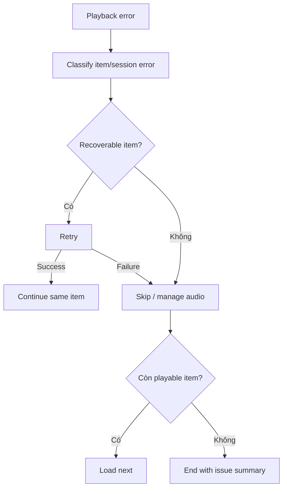

# Đặc tả UI/UX hoàn chỉnh — Recover Playback Error

Flow này xử lý missing/broken audio, decode/network/storage failure và duy trì queue health.

## 1. Nguyên tắc đã chốt

- Lỗi một item không làm mất toàn bộ queue.
- Retry không tăng queue position hoặc duplicate item.
- Skip phải explicit hoặc theo policy đã hiển thị.
- Broken asset được báo về Flashcard flow; Player không tự sửa/xóa Card audio.
- Nếu không còn playable item, chuyển End/No playable audio rõ ràng.

## 2. Master flow

## 3. Error presentation

- Copy phân biệt unavailable item, temporary load và player unavailable.
- Primary recovery là Retry khi có ích; Skip là secondary.
- Issue summary nêu số item skipped, không lộ path nội bộ.

## 4. Lifecycle

- Error checkpoint giữ item/position/attempt count.
- Double Retry cùng request không load hai transport.
- Manage audio handoff quay lại queue và revalidate reference.
- Session-level failure giữ queue để reopen/retry.

## 5. State matrix

- Missing, corrupt, temporary, permission/storage, all-items-failed.
- Retry success/failure, skip, manage-return, background error.
- Long copy, large font, narrow, light/dark.

## 6. Acceptance criteria

- Item lỗi không crash hoặc corrupt queue.
- Retry/Skip cho kết quả deterministic và không đổi Progress.
- Asset mutation chỉ qua Flashcard contract.
- End summary phản ánh chính xác played/skipped items.
