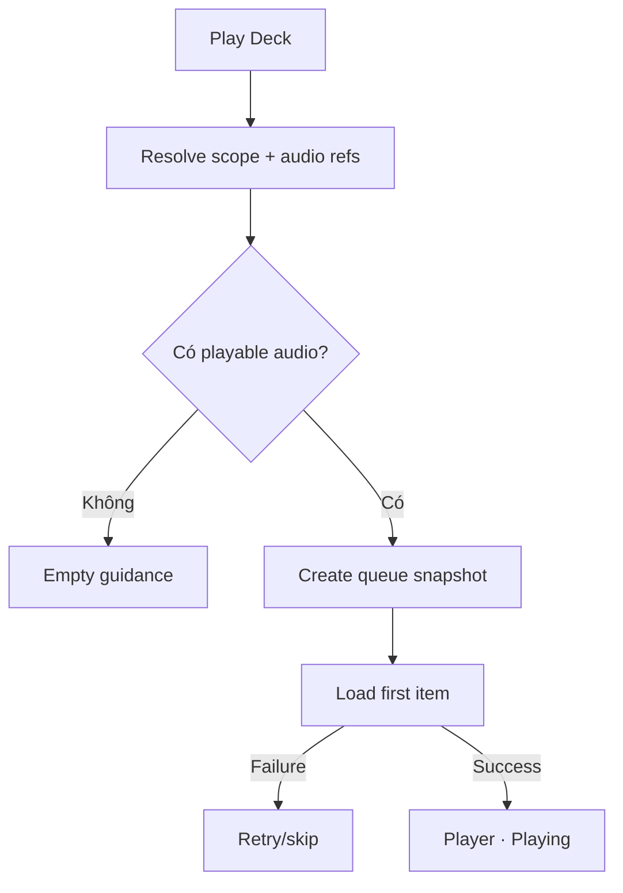

# Đặc tả UI/UX hoàn chỉnh — Start Deck Playback

Flow này tạo một playback session từ Deck scope và snapshot các Card có audio phát được.

## 1. Nguyên tắc đã chốt

- Scope được revalidate trước Start; Parent aggregate descendant Cards đúng một lần.
- Queue chỉ chứa audio reference hợp lệ tại thời điểm snapshot.
- Không có playable audio thì không tạo session rỗng.
- Double-submit/retry tạo tối đa một playback session.
- Start Playback không tạo Study Session hoặc Progress.

## 2. Master flow

## 3. Objective và composition

- Objective: bắt đầu nghe Deck bằng một hành động.
- Archetype: Media handoff.
- Primary CTA: `Play audio`.
- Empty guidance liên kết tới Card audio management khi phù hợp.

## 4. Lifecycle

- Starting khóa CTA và giữ Deck context.
- Queue snapshot gồm Card/audio ids, order, voice/speed effective và position 0.
- Failure không để orphan session; Retry giữ selection.
- Success mở Player và bắt đầu theo autoplay policy.

## 5. State matrix

- Leaf/Parent/deep scope; one/dense queue; no playable audio.
- Starting, first-item error, skip, failure, success.
- Long Deck/Card names, large font, narrow, light/dark.

## 6. Acceptance criteria

- Queue không chứa Card ngoài scope hoặc audio ineligible.
- Start/retry không duplicate session.
- Empty state không giả Study completion.
- Snapshot đủ để Player tiếp tục độc lập với Library UI.
