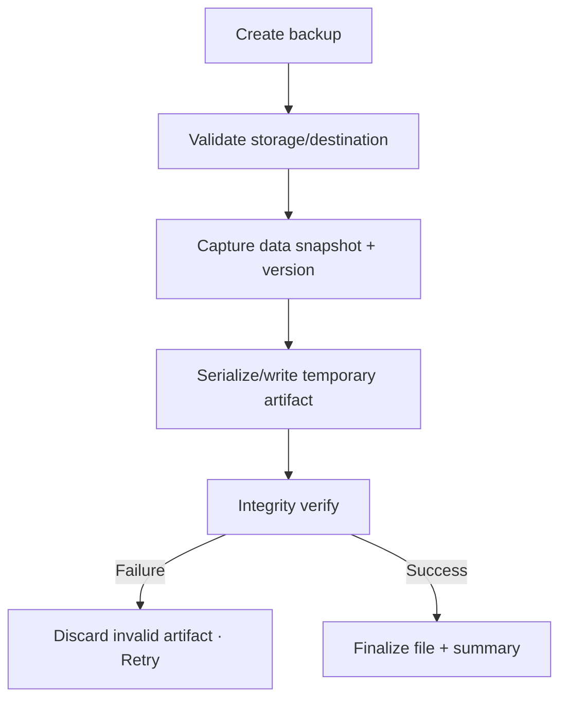

# Đặc tả UI/UX hoàn chỉnh — Create Local Backup

Flow này tạo consistent versioned snapshot và ghi thành file local có integrity metadata.

## 1. Nguyên tắc đã chốt

- Snapshot đại diện một point-in-time dataset nhất quán.
- File chỉ được công bố hoàn tất sau serialize/write/integrity check thành công.
- Không để partial file mang tên backup hợp lệ.
- Request/retry idempotent ở job level.
- Copy/share cảnh báo dữ liệu nhạy cảm phù hợp.

## 2. Master flow

## 3. Objective và composition

- Objective: tạo một file có thể dùng để restore.
- Archetype: Configuration/progress/completion.
- Primary CTA `Create backup`; summary có date/version/object counts/size.

## 4. Lifecycle

- Creating khóa duplicate submit nhưng cho background policy rõ.
- Low storage/permission/file picker cancel giữ config.
- App restart resolve job/artifact trước Retry.
- Success mới cho Save/Share action.

## 5. State matrix

- Empty/normal/large dataset, destination selected/cancelled.
- Creating/progress/low-storage/write/integrity failure/success.
- Background/interrupted/retry, long counts, light/dark.

## 6. Acceptance criteria

- Backup success luôn pass integrity metadata.
- Không có half snapshot hoặc partial valid file.
- Retry không duplicate committed artifact ngoài explicit new run.
- Summary phản ánh snapshot thực tế.
