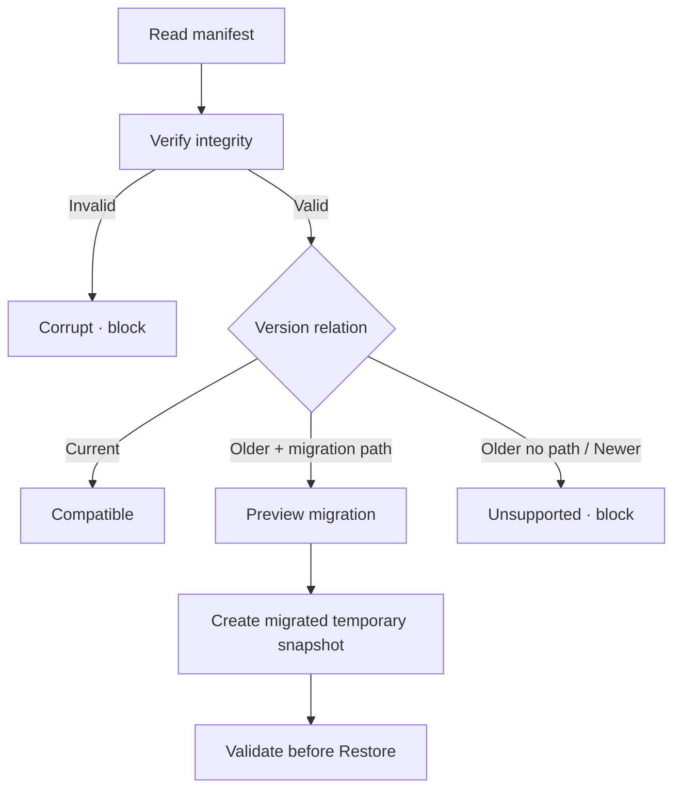

# Đặc tả nghiệp vụ hoàn chỉnh — Handle Backup Compatibility

Flow này phân loại current, older-migratable, newer-unsupported và corrupt backup, rồi quyết định đường xử lý an toàn.

## 1. Nguyên tắc đã chốt

- Compatibility dựa format/schema version và capability manifest.
- Integrity failure không được gọi là chỉ version mismatch.
- Migration path phải explicit, ordered và tested theo source→target version.
- Newer unsupported fail closed; không best-effort restore.
- Original file không bị rewrite trong inspect/migration.

## 2. Master flow

## 3. Decision contract

| State | Restore behavior |
| --- | --- |
| Current valid | Allow review/restore |
| Older migratable | Migrate copy, validate, then allow |
| Newer unsupported | Block; update guidance |
| Corrupt/truncated | Block; choose another file |

## 4. Lifecycle

- Migration failure giữ original và không mutate local data.
- Capability missing được nêu trong impact summary.
- Same fingerprint/version check cacheable nhưng revalidate trước restore.

## 5. State matrix

- Current, multiple older versions, newer, missing manifest.
- Corrupt checksum, partial file, migration failure/success.
- Large manifest/dataset và unknown optional capability.

## 6. Acceptance criteria

- Unsupported/corrupt file không tới commit.
- Migration không sửa original.
- Result sau migration pass current schema/invariants.
- User thấy lý do block và recovery phù hợp.
