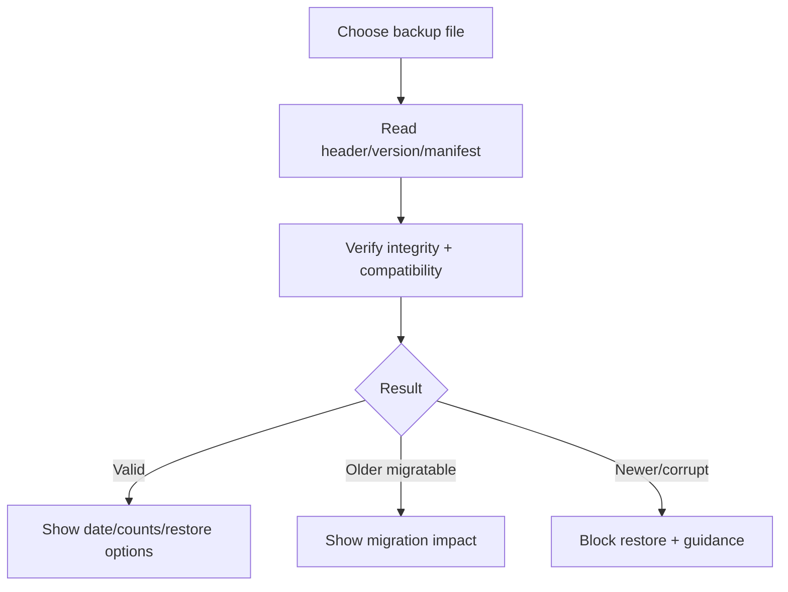

# Đặc tả UI/UX hoàn chỉnh — Inspect Backup

Flow này đọc metadata, compatibility, object counts và integrity trước khi user quyết định Restore.

## 1. Nguyên tắc đã chốt

- Inspect là read-only; không mutate local data.
- Metadata không đáng tin cho đến khi schema/integrity validation tối thiểu pass.
- Không render raw sensitive content trong preview mặc định.
- Valid/older/newer/corrupt là states khác nhau.
- Restore CTA chỉ enabled khi compatibility path an toàn đã xác định.

## 2. Master flow

## 3. Objective và composition

- Objective: hiểu file backup trước mutation.
- Archetype: File inspection/review.
- Summary có version/date/source/counts/integrity; không chỉ filename.

## 4. Lifecycle

- Picker cancel trở lại không lỗi.
- Inspect loading/failure giữ prior safe screen.
- File thay đổi giữa inspect/restore buộc re-inspect bằng fingerprint.
- Large manifest được stream/progress khi cần.

## 5. State matrix

- Valid current/older/newer/corrupt/truncated/wrong-file.
- Empty/large dataset, cancelled picker, permission/read failure.
- Long filename/counts, large font, narrow, light/dark.

## 6. Acceptance criteria

- Inspect không thay đổi local objects.
- Restore không bật cho file chưa xác định an toàn.
- Fingerprint gắn preview với file sẽ restore.
- UI phân biệt compatibility và integrity failure.
