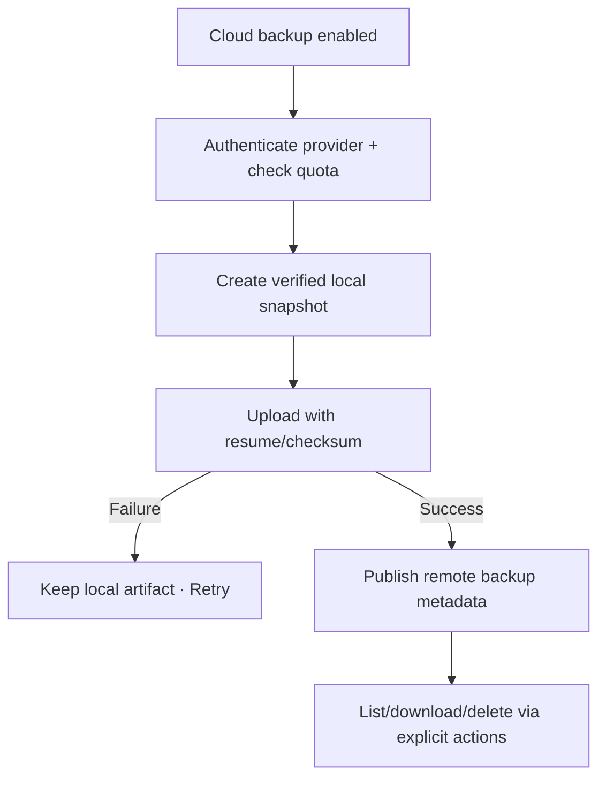

# Đặc tả quyết định UI/UX — Manage Cloud Backup (Conditional)

Flow này chỉ có hiệu lực khi cloud provider/dependency được duyệt. Backup vẫn sở hữu snapshot/compatibility; provider chỉ lưu và vận chuyển file.

## 1. Trạng thái phạm vi

- Provider, quota, encryption, retention và background policy: **chưa xác nhận**.
- Không hiển thị entry point hoặc hứa auto-backup trước khi các dependency được duyệt.
- Cloud Backup khác ongoing Account Sync.

## 2. Nguyên tắc bắt buộc nếu được duyệt

- Upload chỉ file đã pass local integrity.
- Remote object có stable backup id, version, checksum và created time.
- Download verify checksum trước Inspect/Restore.
- Delete remote backup là explicit destructive action.
- Credential/provider failure không ảnh hưởng local data.

## 3. Master flow conditional

## 4. State matrix

- Unsupported/feature hidden, signed-out/provider connected.
- Quota/permission/network/auth error, upload pending/progress/failure/success.
- Remote list empty/dense, download checksum failure, delete confirm.

## 5. Acceptance criteria để mở feature

- Provider/security/privacy/retention contracts đã được duyệt.
- Upload/download integrity end-to-end được xác minh.
- Retry không tạo duplicate remote backups ngoài intentional runs.
- Cloud failure không xóa hoặc corrupt local snapshot/data.
