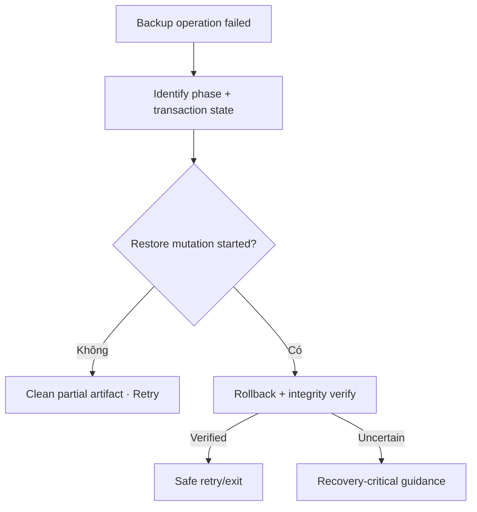

# Đặc tả UI/UX hoàn chỉnh — Recover Backup Failure

Flow này xử lý lỗi create/inspect/restore, xác minh rollback và cung cấp retry/support information an toàn.

## 1. Nguyên tắc đã chốt

- Error được phân loại theo phase và recoverability.
- Retry giữ source/config nhưng không reuse invalid partial artifact.
- Restore failure phải xác minh rollback trước khi cho app tiếp tục bình thường.
- Support copy không lộ credentials/raw content.
- Critical rollback uncertainty có recovery path riêng.

## 2. Master flow

## 3. Objective và presentation

- Objective: trở về trạng thái dữ liệu biết chắc hoặc hướng dẫn recovery.
- Archetype: Recoverable/critical error.
- Primary CTA tùy phase: Retry, Choose another file, Free space hoặc Recovery steps.

## 4. Lifecycle

- Unknown create outcome inspect artifact before regenerate.
- Unknown restore outcome inspect transaction journal trước Retry.
- Error details có correlation id/copy action, không hiển thị stack trace.
- App background giữ recovery status.

## 5. State matrix

- Read/write/storage/permission/integrity/migration errors.
- Rollback verified/failed/unknown, retry success/failure.
- Interrupted app, large dataset, long support copy.

## 6. Acceptance criteria

- Không báo safe khi rollback chưa được xác minh.
- Retry không dùng partial invalid file.
- User không mất config/source selection không cần thiết.
- Diagnostic copy không chứa dữ liệu nhạy cảm.
