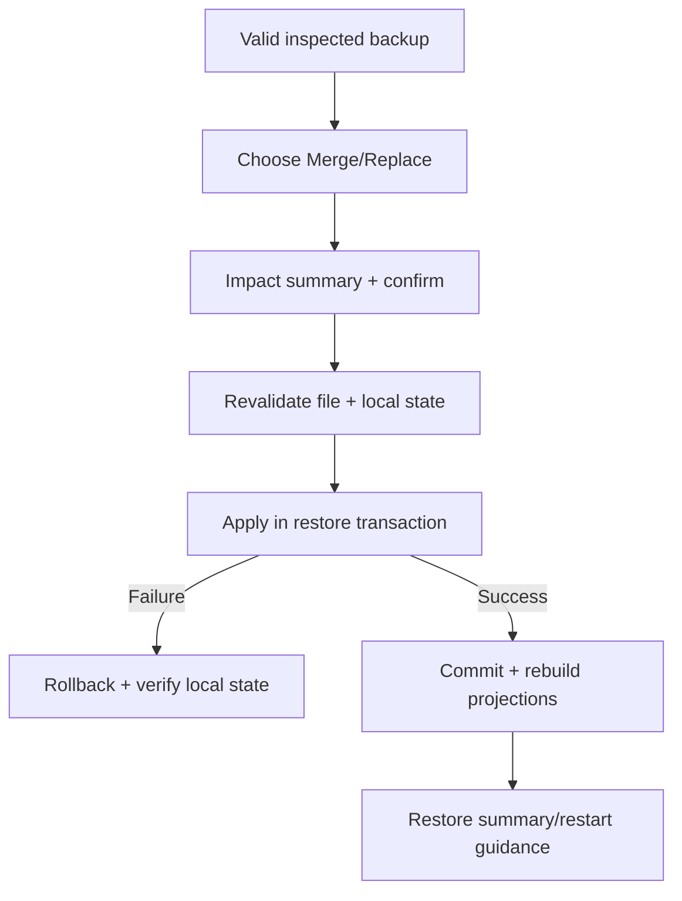

# Đặc tả UI/UX hoàn chỉnh — Restore Local Backup

Flow này restore file đã inspect theo Merge hoặc Replace decision trong một transaction có rollback.

## 1. Nguyên tắc đã chốt

- File fingerprint/compatibility được revalidate trước commit.
- User biết rõ Merge hay Replace và impact trước confirm.
- Restore atomic; failure rollback toàn bộ.
- Replace không được diễn ra từ copy mơ hồ.
- Retry/unknown outcome resolve transaction state trước chạy lại.

## 2. Master flow

## 3. Objective và composition

- Objective: khôi phục dataset có chủ ý và an toàn.
- Archetype: Destructive review/progress/result.
- Replace dùng destructive confirmation; Merge nêu duplicate/conflict policy.

## 4. Lifecycle

- Restoring khóa app mutations hoặc dùng consistency policy rõ.
- Background/interruption không để half state.
- Rollback failure chuyển recovery-critical state, không báo restore failed đơn giản.
- Success refresh/rebuild object projections trước usable state.

## 5. State matrix

- Merge/Replace, no conflict/conflicts, empty/current data.
- Restoring/cancel-before-start/failure/rollback success/failure/success.
- Low storage, app interruption, large backup, long summary.

## 6. Acceptance criteria

- Không có half-restored database.
- Mode/impact được user xác nhận rõ.
- Failure giữ/khôi phục pre-restore state có thể kiểm chứng.
- Success chạy validation/rebuild trước khi hoàn tất.
