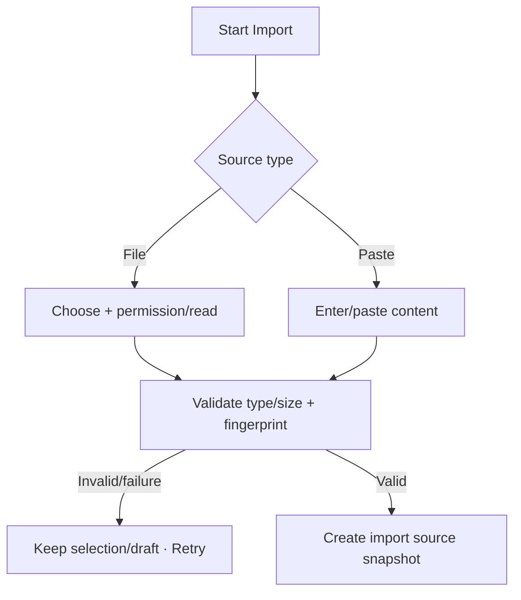

# Đặc tả UI/UX hoàn chỉnh — Choose Import Source

Flow này nhận file hoặc pasted content, xử lý permission/read và tạo source snapshot cho Import job.

## 1. Nguyên tắc đã chốt

- Source chỉ được đọc sau user action và permission phù hợp.
- File/type/size được validate trước parsing sâu.
- Picker cancel là no-op, không phải error.
- Source snapshot/fingerprint ổn định cho các bước mapping/preview.
- Nội dung source không commit Deck/Card ở bước này.

## 2. Master flow

## 3. Objective và composition

- Objective: cung cấp source có thể parse cho Import.
- Archetype: Source selection.
- Primary CTA `Choose file` hoặc `Continue` cho pasted content; supported formats được nêu rõ.

## 4. Lifecycle

- Reading có progress/cancel policy cho file lớn.
- File thay đổi sau selection làm fingerprint invalid và buộc chọn lại.
- Permission denial có recovery; không loop prompt.
- Success chuyển Mapping/Preview theo format capability.

## 5. State matrix

- File/paste, picker cancel, empty paste, unsupported/large file.
- Permission/read failure, reading/progress/success.
- Long filename/content, keyboard, narrow, light/dark.

## 6. Acceptance criteria

- Không commit content ở source step.
- Cancel không hiển thị failure.
- Invalid file không tới parser/commit.
- Snapshot/fingerprint gắn đúng source qua toàn job.
