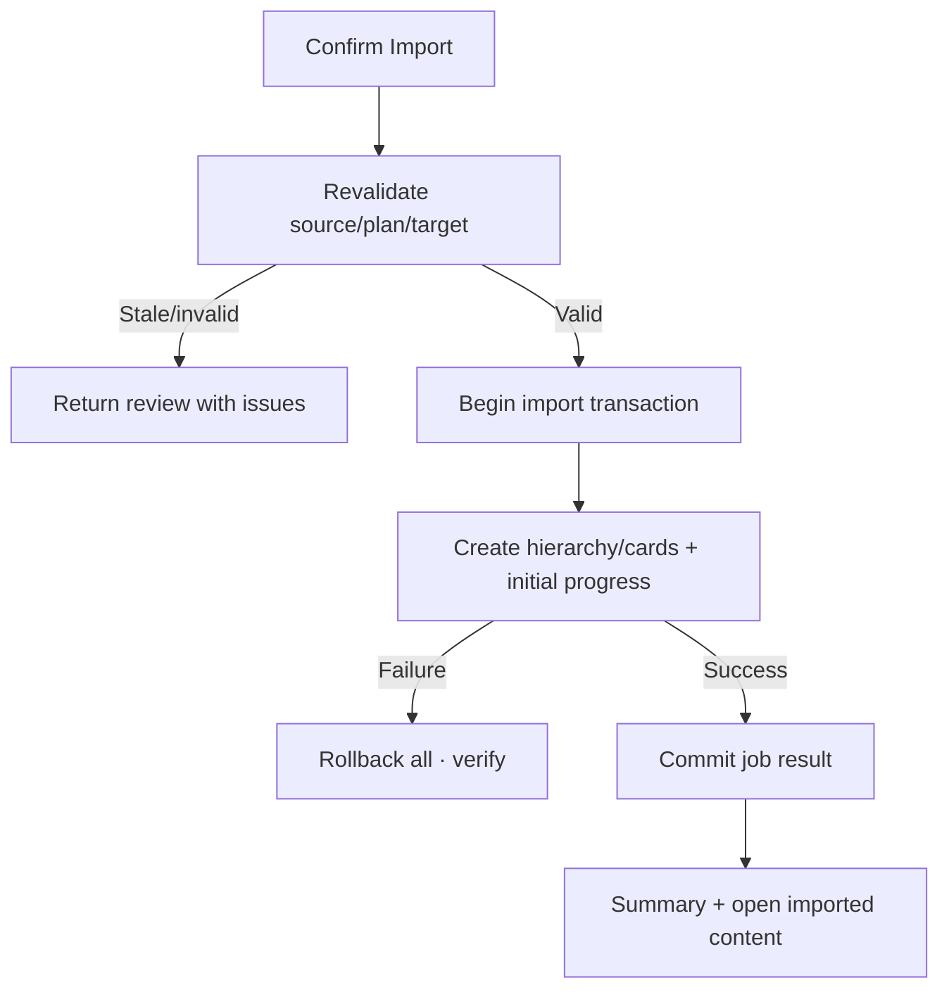

# Đặc tả UI/UX hoàn chỉnh — Commit Import

Flow này revalidate confirmed plan và ghi Deck/Card content atomically theo job identity.

## 1. Nguyên tắc đã chốt

- Commit chỉ dùng source fingerprint + plan version đã preview/confirm.
- Target/hierarchy/Card data được revalidate trước write.
- Job atomic theo confirmed plan; không để half import.
- Retry/unknown outcome không duplicate content.
- Summary phản ánh created/merged/skipped/failed chính xác.

## 2. Master flow

## 3. Objective và composition

- Objective: áp dụng đúng plan đã duyệt một lần.
- Archetype: Final review/progress/result.
- Confirm copy nêu target, created/merged/skipped counts.

## 4. Lifecycle

- Importing disable Back/double-submit theo transaction policy.
- App interruption resume/resolve job identity trước retry.
- Rollback failure vào recovery-critical state.
- Success refresh Deck/Search/Statistics projections theo events.

## 5. State matrix

- Flat/hierarchy, Empty/Leaf/new hierarchy targets.
- Stale target/source/candidate, importing/progress/failure/rollback/success.
- Large job, low storage, app interruption, offline.

## 6. Acceptance criteria

- Không half import hoặc duplicate retry.
- Parent/Leaf/Language Pair invariants giữ nguyên.
- Initial Progress tạo cùng consistency boundary với Card.
- Result summary khớp committed plan.
