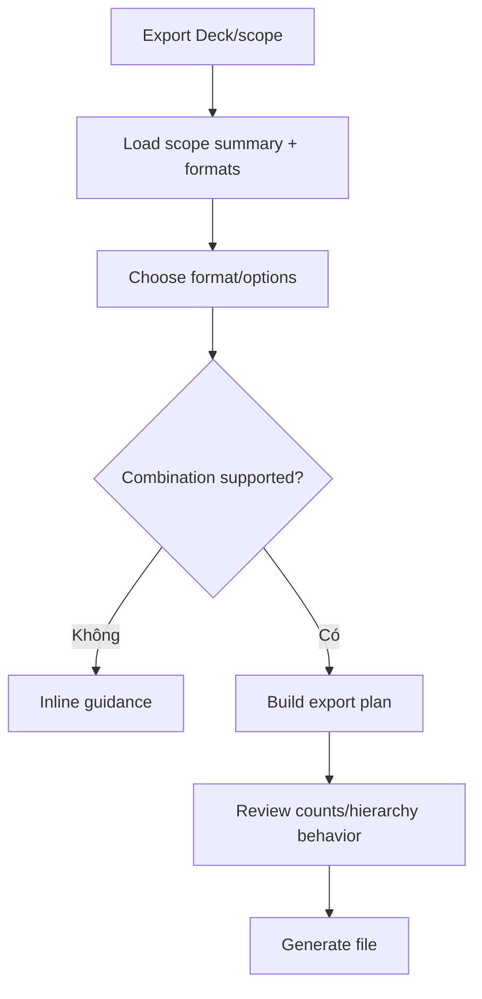

# Đặc tả UI/UX hoàn chỉnh — Configure Export

Flow này nhận Deck scope từ owning contract, chọn format/options và tạo export plan trước generation.

## 1. Nguyên tắc đã chốt

- Scope eligibility thuộc Deck; Content Transfer revalidate snapshot.
- Format/options chỉ trong supported capability set.
- User biết hierarchical content có được giữ hay flatten.
- Content export không được gọi là Backup nếu thiếu progress/settings/history.
- Configure không tạo file.

## 2. Master flow

## 3. Objective và composition

- Objective: xác định file sẽ chứa gì và theo format nào.
- Archetype: Configuration form.
- Scope/path/counts readonly; format/options editable; `Export` primary.

## 4. Validation và lifecycle

- Empty scope bị chặn hoặc cho empty export chỉ khi format policy rõ.
- Hidden/audio/translations inclusion có explicit toggles khi supported.
- Scope mutation trước generation làm revalidation/summary update.
- Cancel không tạo job/file.

## 5. State matrix

- Leaf/Parent/deep scope, one/large content set.
- Formats/options supported/invalid, flatten warning, stale scope.
- Long names/path, large font, narrow, light/dark.

## 6. Acceptance criteria

- Plan nêu rõ scope, format và hierarchy behavior.
- Unsupported combination không tới generation.
- Export không giả full Backup.
- Configure không mutate Deck/Card.
