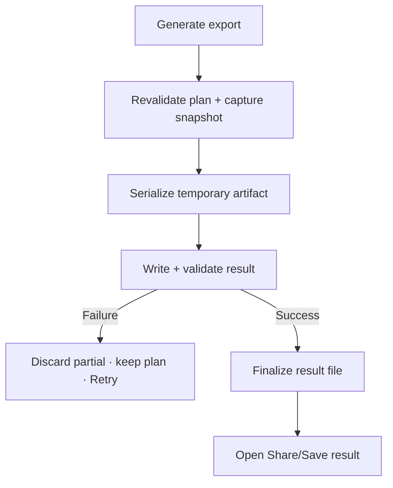

# Đặc tả UI/UX hoàn chỉnh — Generate Export File

Flow này chụp consistent content snapshot, serialize và ghi file hoàn chỉnh theo export plan.

## 1. Nguyên tắc đã chốt

- Generation dùng một source snapshot/version nhất quán.
- Serializer tuân format và không bypass content validation.
- Partial file không được công bố/chia sẻ.
- Retry cùng job không tạo result mâu thuẫn.
- File metadata/filename được sanitize và không lộ path nội bộ.

## 2. Master flow

## 3. Objective và composition

- Objective: tạo file export usable đúng cấu hình.
- Archetype: Progress/result.
- Progress có phase/count; Cancel chỉ khi serializer/write hỗ trợ cleanup an toàn.

## 4. Lifecycle

- Scope changed after snapshot không đổi current file; summary gắn snapshot time.
- Low storage/permission errors giữ plan.
- App interruption resolve temp/job trước Retry.
- Success mới enable Share/Save.

## 5. State matrix

- Flat/hierarchy, small/large scope, options combinations.
- Generating/progress/cancel/storage/serialize/write/validation failure.
- Background/interruption/retry/success, long filename.

## 6. Acceptance criteria

- File phản ánh một consistent snapshot.
- Không share partial/invalid artifact.
- Retry không mutate Deck/Card hoặc duplicate logical result.
- Result metadata khớp plan/snapshot.
