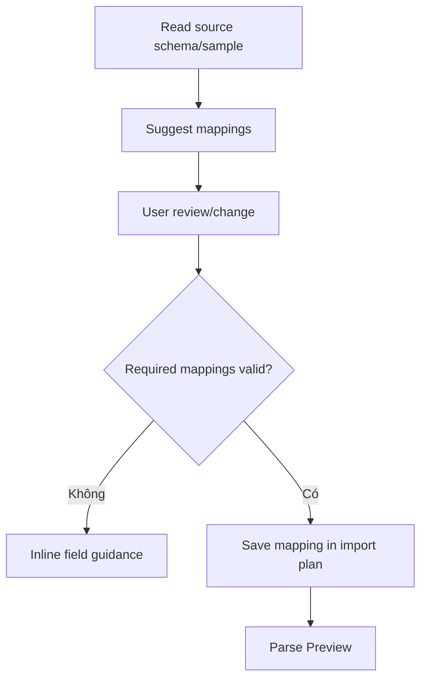

# Đặc tả UI/UX hoàn chỉnh — Map Import Fields

Flow này ánh xạ source columns/fields tới term, primary meaning và optional Flashcard fields trước Preview.

## 1. Nguyên tắc đã chốt

- Term và primary meaning mapping bắt buộc cho flat Card import.
- Một source field không map vào nhiều required targets nếu policy không cho phép.
- Auto-detection chỉ là suggestion, user có thể review/change.
- Mapping gắn source fingerprint/schema; source đổi thì invalid.
- Mapping không mutate source hoặc target Deck.

## 2. Master flow

## 3. Objective và composition

- Objective: giải thích source field nào trở thành Card field nào.
- Archetype: Mapping form.
- Target fields có required/optional labels; source samples hỗ trợ nhận biết.

## 4. Validation và lifecycle

- Missing column, duplicate required mapping và incompatible type bị chặn.
- Long/multilingual headers wrap; duplicate headers có index/path.
- Mapping draft giữ khi preview parse failure quay lại.
- Format có canonical mapping có thể skip UI nhưng vẫn ghi plan.

## 5. State matrix

- Suggested/manual, minimum/many fields, missing required.
- Duplicate/blank headers, incompatible field, source changed.
- Keyboard, large font, narrow, light/dark.

## 6. Acceptance criteria

- Import plan luôn có required mappings hợp lệ.
- Suggestion không commit tự động ngoài policy.
- Mapping traceable tới source fingerprint/schema.
- Back/Retry giữ draft phù hợp.
