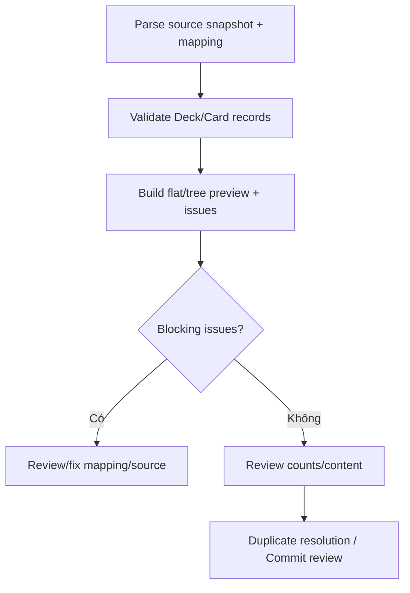

# Đặc tả UI/UX hoàn chỉnh — Preview Import

Flow này parse source theo mapping, hiển thị flat/hierarchy preview, invalid rows và counts trước Commit.

## 1. Nguyên tắc đã chốt

- Preview dùng cùng parser/config sẽ dùng cho commit plan.
- Valid/invalid/skipped/duplicate candidates có counts riêng.
- Hierarchy preview không được làm phẳng âm thầm.
- Invalid row có reason và source location đủ sửa.
- Preview không persist Deck/Card.

## 2. Master flow

## 3. Objective và composition

- Objective: hiểu chính xác content nào sẽ được import.
- Archetype: Review/preview.
- Summary counts trước sample/tree; issues filterable theo severity.
- Primary CTA chỉ enabled khi plan có commit-eligible content.

## 4. Lifecycle

- Large source dùng progressive preview nhưng final counts phải complete trước commit.
- Parser failure giữ source/mapping và Retry.
- Source fingerprint mismatch invalidates preview.
- Edit mapping/source tạo plan version mới.

## 5. State matrix

- Flat/hierarchy, all valid/mixed/all invalid, empty source.
- Duplicate candidates, deep tree, long text, large file/progress.
- Parse failure, source changed, large font, narrow, light/dark.

## 6. Acceptance criteria

- Preview và commit dùng cùng versioned plan.
- Invalid rows không bị commit âm thầm.
- Hierarchy/counts đúng và audit được.
- Không mutation business data ở Preview.
