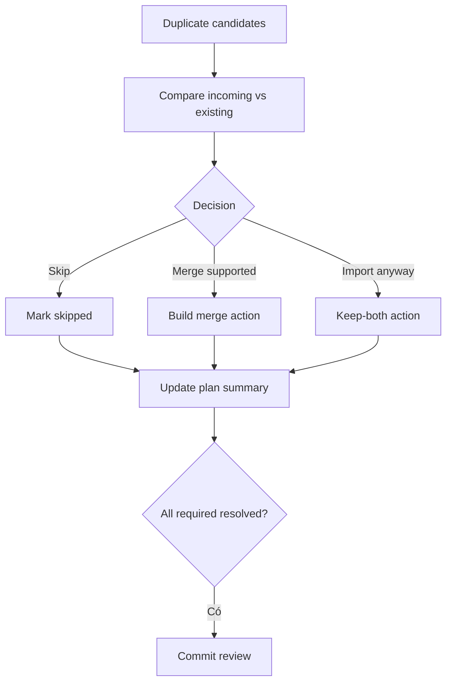

# Đặc tả UI/UX hoàn chỉnh — Resolve Import Duplicates

Flow này tạo Skip, Merge hoặc Import anyway decision cho duplicate candidates trước commit.

## 1. Nguyên tắc đã chốt

- Candidate detection không tự xóa/ghi đè.
- Decision có thể per-item hoặc bulk, nhưng bulk impact phải rõ.
- Merge chỉ dùng Flashcard merge contract và target hợp lệ.
- Same term khác meaning không mặc định là exact duplicate.
- Plan giữ decision ids/version để commit deterministic.

## 2. Master flow

## 3. Objective và composition

- Objective: quyết định có chủ ý cho từng duplicate class.
- Archetype: Compare/resolution list.
- Incoming/existing content và Deck path phải phân biệt rõ.

## 4. Lifecycle

- Bulk choice có undo trước commit.
- Existing Card thay đổi sau preview làm candidate stale và re-resolve.
- Unsupported merge disabled với reason.
- Back giữ decisions trong current import job.

## 5. State matrix

- Exact/near/same-term candidates; one/many.
- Skip/merge/keep-both/bulk/undo, stale existing Card.
- Long multilingual content, large font, narrow, light/dark.

## 6. Acceptance criteria

- Không candidate nào bị overwrite không explicit.
- Merge tuân Flashcard invariants.
- Commit plan chứa resolved action deterministic.
- Stale candidate bị chặn trước commit.
