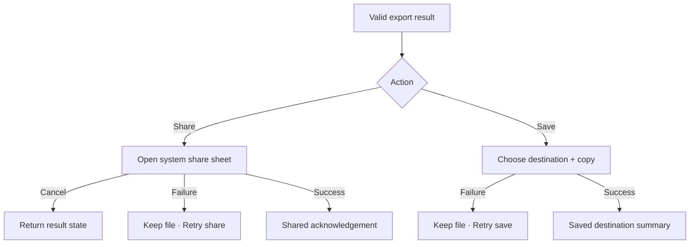

# Đặc tả UI/UX hoàn chỉnh — Share Export File

Flow này lưu/chia sẻ export result và phục hồi share-only failure mà không regenerate file không cần thiết.

## 1. Nguyên tắc đã chốt

- Chỉ file result đã finalized/validated được share.
- Share cancel là no-op, không phải export failure.
- Share failure không xóa result file còn hợp lệ.
- Retry Share reuse cùng result fingerprint.
- Cảnh báo dữ liệu nhạy cảm theo content policy.

## 2. Master flow

## 3. Objective và composition

- Objective: đưa file đã tạo tới destination mong muốn.
- Archetype: Result actions/system handoff.
- `Share` hoặc `Save` primary theo entry context; Regenerate là secondary.

## 4. Lifecycle

- File missing/expired trước share chuyển Generate recovery.
- App background/system sheet return giữ result screen.
- Multiple shares được phép nhưng không tạo export job mới.
- Cleanup temp file chỉ sau retention policy, không ngay khi share cancel.

## 5. State matrix

- Share/save, cancel, permission/destination/share provider failure.
- File missing/expired, retry success, repeated share.
- Long filename/destination, large font, narrow, light/dark.

## 6. Acceptance criteria

- Cancel không báo failure hoặc regenerate.
- Share-only failure giữ result usable.
- Chỉ validated file được handoff.
- Retry không thay nội dung/fingerprint file.
