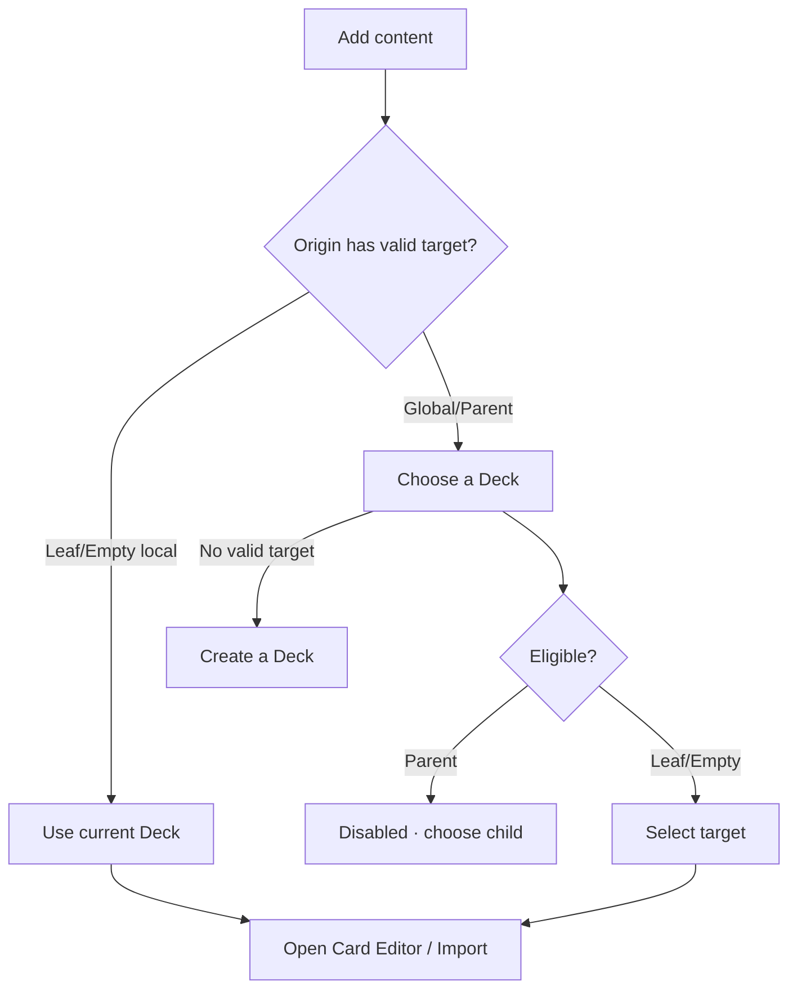

# Đặc tả UI/UX hoàn chỉnh — Add Content to Deck

Phạm vi tài liệu này sở hữu eligibility và target selection khi thêm card hoặc import vào Deck. Card Editor và Import engine được đặc tả riêng.

## 1. Nguyên tắc đã chốt

- Leaf và Empty có thể nhận flat cards.
- Parent không nhận direct cards; user phải chọn child Leaf/Empty hoặc tạo child.
- Empty nhận card đầu tiên thành Leaf.
- Empty nhận child đầu tiên thành Parent.
- Leaf không thể nhận child; muốn tạo child phải move/delete toàn bộ card để Deck trở lại Empty trước.
- Khi nội dung cuối cùng không còn, Deck trở lại Empty và không giữ mode cũ.
- Global Add Card luôn xác định target trước Card Editor.
- Local Add Card từ Leaf/Empty dùng current Deck, không hỏi lại target.
- Không tự tạo Deck/card khi user chỉ chọn target.

## 2. Entry points

| Context | Action | Target step |
| --- | --- | --- |
| Dashboard/global Add | Add card | Picker bắt buộc |
| Empty Deck | Add card | Current Deck trực tiếp |
| Leaf Deck | Add card | Current Deck trực tiếp |
| Parent Deck | Add card attempt | Chọn child; Parent disabled |
| Import flat | Import cards | Leaf/Empty picker |
| Card move | Move card | Leaf/Empty picker, source rules áp dụng |

# 3. Master flow



# 4. Target picker

- Objective: chọn Deck nhận content.
- Archetype: Selection.
- Không có primary CTA; tap eligible row tiếp tục flow.

```text
←  Choose a deck

Korean TOPIK I                         Parent      disabled
  Vocabulary                           320 cards
  Grammar                              120 cards
Japanese Basics                         0 cards
```

- Parent helper: `Choose one of its nested decks.`
- Empty row dùng `0 cards`; Leaf dùng card count.
- Hierarchy indentation/path không được là dấu hiệu duy nhất; label accessible phải nêu context.

# 5. No-target state

```text
No deck can receive cards yet

Create a deck first, or open an empty deck and add a card there.

[ Create deck ]
```

- Create success quay lại target flow với Deck mới được highlight/preselected nhưng không tự mở editor nếu user đã rời flow.
- Cancel Create quay lại no-target state.

# 6. Eligibility decision table

| Target type | Add card | Import flat | Move card in | Reason |
| --- | ---: | ---: | ---: | --- |
| Empty | Có | Có | Có | First card makes Leaf |
| Leaf | Có | Có | Có | Holds direct cards |
| Parent | Không | Không | Không | Holds child Decks only |
| Missing/error | Không | Không | Không | Reload required |

# 7. Selection lifecycle

- Loading: skeleton hierarchy; không cho chọn trước eligibility.
- Selection success: pass stable target context to next flow.
- Target becomes Parent/deleted before save: next flow chặn save và yêu cầu chọn lại.
- Load failure: `Couldn’t load your decks. Try again.`
- No target: giữ entry intent (Add/Import/Move) khi user tạo Deck rồi quay lại.

# 8. Return behavior

- Card save vào Empty → target render Leaf và card mới được highlight.
- Card save vào Leaf → giữ list/filter hợp lý và highlight card.
- Cancel editor/import → target không đổi.
- Failure → giữ form/source ở owning feature; không quay picker trừ khi target invalid.
- Parent source không bao giờ render card row sau success.

# 9. Search và deep hierarchy

- Picker cho tìm theo Deck name/path.
- Parent result vẫn visible disabled với helper.
- Deep eligible Leaf/Empty selectable; result hiển thị ancestor path.
- Không tự select first result.

# 10. State matrix

- Picker loaded/minimum/dense/deep; loading/error/offline.
- Parent disabled helper; no valid target; create-return.
- Target stale/deleted/changed type.
- Search/no-results; long path/name/count; keyboard; large font; narrow device; light/dark.

# 11. Action visibility matrix

| Origin | Direct Add | Target picker | Create Deck |
| --- | ---: | ---: | ---: |
| Empty | Có | Không | Secondary create child |
| Leaf | Có | Không | Không |
| Parent | Không | Child picker | Có child |
| Dashboard | Không | Bắt buộc | Khi no target |

# 12. Acceptance criteria

- Parent không bao giờ selectable cho flat card operations.
- Leaf/Empty selectable ở mọi depth với path rõ.
- Local Leaf/Empty không hỏi target thừa.
- Empty chỉ thành Leaf sau card/import success.
- Leaf không có đường chuyển trực tiếp sang Parent; mixed content không được persist.
- Stale target được chặn trước persist và form/source không mất.
- No-target CTA giữ original intent qua Create flow.
- Canonical Add Card target states đạt parity dưới 3% mỗi theme.
