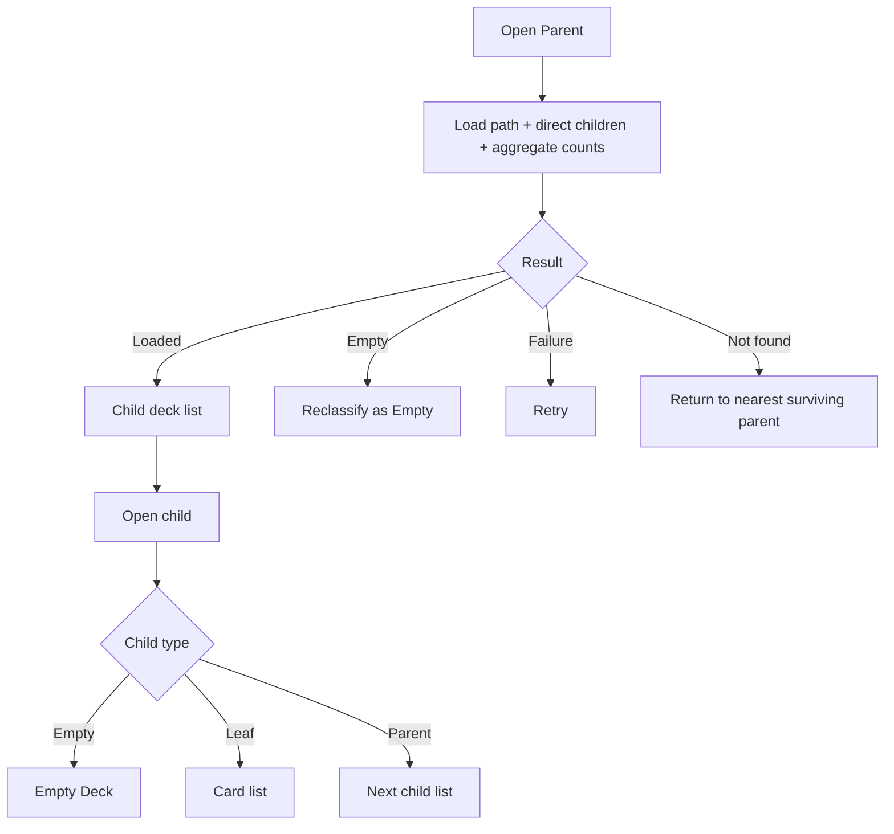

# Đặc tả UI/UX hoàn chỉnh — Browse Nested Decks

Phạm vi tài liệu này mô tả duyệt cây Deck, breadcrumb và child list. Create/Move/Delete/Edit child mở đặc tả tương ứng, không được định nghĩa lại ở đây.

## 1. Nguyên tắc đã chốt

- Parent chỉ hiển thị direct child Deck, không hiển thị direct card.
- Aggregate card count bao gồm mọi descendant Leaf.
- Tap child luôn đi qua `open-deck.md` để phân loại child hiện tại.
- Deep nesting phải giữ đường dẫn và Back về parent trực tiếp.
- Search trong Parent mặc định scoped vào direct children hiện tại.
- Bottom navigation chỉ xuất hiện tại Library root, không lặp trong nested context.

## 2. Entry points

| Context | Trigger | Initial context |
| --- | --- | --- |
| Library | Open Parent | Parent root của subtree |
| Parent | Open child Parent | Level tiếp theo |
| Search result | Open nested Deck | Path tới Deck được tái tạo |
| Create/Move success | Return | Parent destination |
| Study result | Back to Parent | Parent đã khởi tạo Study |

# 3. Master flow



# 4. Objective, archetype và composition

- Objective: tìm và mở đúng child Deck trong current subtree.
- Archetype: List.
- Primary CTA: `Create deck`.

```text
←  <Parent name>                         Search       More

Library / <ancestor> / <Parent>
<child count> nested decks · <aggregate card count> cards

[ Child A                         320 cards ]
[ Child B                         120 cards ]
[ Child C                          46 cards ]

                                           + Create deck
```

- Breadcrumb dài được scroll/wrap theo component contract; current node luôn rõ.
- Row ưu tiên title, sau đó card/child count; không hiển thị card preview trực tiếp.

# 5. Child row behavior

- Tap row mở child.
- Overflow mở actions phù hợp: Study, Rename, Move, Delete.
- Selection mode chỉ chọn child trực tiếp ở level hiện tại.
- Parent row có child count và aggregate card count; Leaf row có card count; Empty row có `0 cards`.
- Không dùng tap row để mở action sheet.

# 6. Search, filter và selection

- Search scoped current direct child list; query không tự tìm card content.
- No result không biến Parent thành Empty.
- Enter selection → app bar hiển thị count; Back thoát selection trước navigation.
- Đổi query/filter/sort xóa selection hiện tại sau confirm nếu có pending action.
- Actions nhiều selection chỉ hiển thị khi hợp lệ cho toàn selection.

# 7. Load/error lifecycle

- Loading: skeleton rows giữ app bar/breadcrumb.
- Offline: hiển thị cached list nếu có + offline callout; Retry refresh.
- Recoverable error: `Couldn’t load the nested decks. Try again.`
- Not found: `This deck is no longer available.`; về nearest surviving parent.
- Child action failure giữ list, scroll và selection liên quan.

# 8. Back và state preservation

- Back trong search đóng search; trong selection thoát selection; sau đó mới về parent.
- Quay lại từ child giữ scroll, sort và search của parent.
- Child vừa tạo/move tới được scroll/highlight một lần.
- Child bị delete/move khỏi list không làm reset toàn screen.

# 9. Empty transition

- Nếu child cuối bị delete/move, current Deck reclassify Empty và dùng composition `open-deck.md`.
- Empty không giữ mode Parent cũ; card hoặc child đầu tiên tiếp theo quyết định loại mới.
- Không giữ FAB Create Deck của Parent song song với Empty primary Add Card.
- Import hierarchy thành công có thể chuyển Empty trở lại Parent.

# 10. State matrix

- Nested loaded/minimum/dense/deep; loading/offline/error/not-found.
- Search/results/no-results; selection; child actions; play sheet.
- Nested create/move/delete success highlight.
- Long breadcrumb/name/count, large font, narrow device, light/dark.

# 11. Action visibility matrix

| Surface | Create child | Add card | Search | Study |
| --- | ---: | ---: | ---: | ---: |
| Parent loaded | Primary | Không | Có | Aggregate |
| Parent search | FAB giữ context | Không | Active | Theo result/parent |
| Selection | Không | Không | Không | Khi hợp lệ |
| Loading/error | Không | Không | Không | Không |
| Reclassified Empty | Secondary | Primary | Không | Disabled |

# 12. Acceptance criteria

- Parent list chỉ có direct child rows, không direct card rows.
- Deep navigation và Back giữ đúng ancestor path/context.
- Aggregate count chính xác, không double-count.
- Search no-results không đổi loại Deck.
- Last-child transition dùng Empty composition.
- Long breadcrumb/font lớn/narrow width không che title/actions.
- Canonical nested Library states đạt parity dưới 3% mỗi theme.
