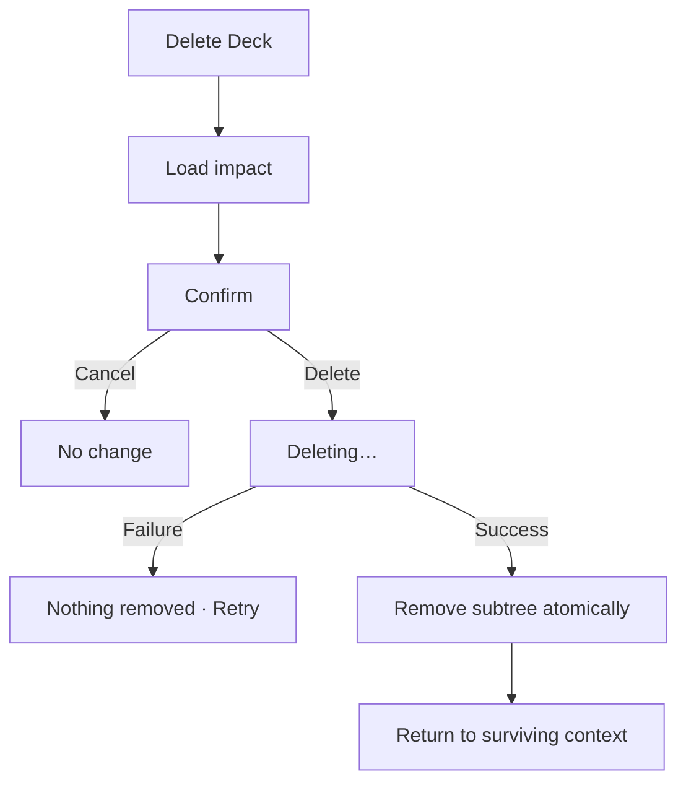

# Đặc tả UI/UX hoàn chỉnh — Delete Deck

Phạm vi tài liệu này mô tả xóa Empty, Leaf hoặc Parent Deck và toàn bộ subtree. Reset learning progress là flow riêng.

## 1. Nguyên tắc đã chốt

- Delete luôn cần explicit confirmation và impact summary.
- Parent delete áp dụng toàn descendants; failure không xóa một phần.
- Copy nêu số child Deck, card và learning progress bị xóa.
- Xóa Deck cuối của user cũ không chạy lại onboarding.
- Không có Undo nếu xóa vĩnh viễn; phải nói rõ trước confirm.

## 2. Entry points

| Context | Trigger | Presentation |
| --- | --- | --- |
| Deck Settings | Delete deck | Confirm dialog |
| Parent child action | Delete | Child-context dialog |
| Library selection một Deck | Delete | Confirm dialog |

# 3. Master flow



# 4. Objective, archetype và composition

- Objective: hiểu chính xác phạm vi mất dữ liệu trước khi xóa.
- Archetype: Destructive confirmation.
- Safe action `Keep deck` được focus mặc định; destructive action `Delete deck`.

## Empty

```text
Delete “<Deck name>”?
This empty deck will be permanently deleted.

Keep deck                              Delete deck
```

## Leaf

```text
Delete “<Deck name>”?
<card count> cards and their learning progress will be permanently deleted.

Keep deck                              Delete deck
```

## Parent

```text
Delete “<Deck name>”?
This includes <descendant count> nested decks, <card count> cards,
and their learning progress. This can’t be undone.

Keep deck                              Delete deck
```

# 5. Impact summary

- Refresh counts ngay trước submit; thay đổi impact yêu cầu confirm lại.
- Parent card count aggregate toàn subtree, không double-count.
- Description, translations, audio refs và progress gắn với cards thuộc impact.

# 6. Lifecycle

- Idle: dialog dismissible bằng safe action.
- Submitting: `Deleting…`; disable dismiss/Back/double-submit.
- Failure: `Couldn’t delete the deck. Nothing has been removed. Try again.`
- Success: remove khỏi list/search/recent; snackbar `Deck deleted`; không về route đã xóa.

# 7. Destination sau success

| Deleted context | Destination |
| --- | --- |
| Root | Library tại vị trí gần nhất |
| Nested | Parent còn tồn tại |
| Child cuối | Parent render Empty |
| Deck cuối Library | Library empty, không onboarding |
| Deep link | Context gần nhất còn tồn tại |

# 8. Cancel và accessibility

- Keep/Back/scrim trước submit đóng và không đổi dữ liệu.
- Focus safe action; dialog trap/restore focus.
- Title/count dài wrap, không ellipsis impact quan trọng.

# 9. Concurrent/offline

- Already deleted: `This deck is no longer available.`
- Local-first delete vẫn hoạt động offline; sync pending xử lý sau.
- Transaction/storage error rollback toàn subtree.
- Khi deleting, chặn Move/Edit/Study cùng Deck.

# 10. State matrix

- Empty/Leaf/Parent confirm; shallow/deep/large aggregate.
- Impact refreshing/changed; deleting/failure/success; not found.
- Last root/last child; long localized copy; large font; narrow device; light/dark.

# 11. Action matrix

| State | Keep | Delete | Dismiss |
| --- | ---: | ---: | ---: |
| Confirm | Safe | Destructive | Có |
| Impact changed | Safe | Confirm lại | Có |
| Deleting | Disabled | Progress | Disabled |
| Failure | Safe | Try again | Có |

# 12. Acceptance criteria

- Mọi delete có confirm và impact đúng loại Deck.
- Parent delete toàn subtree và atomic; failure không mất một phần.
- Child cuối cập nhật Parent → Empty; Deck cuối không chạy onboarding.
- Parent trở lại Empty không giữ mode cũ; content đầu tiên tiếp theo quyết định loại mới.
- Search/recent/list không giữ reference đã xóa.
- Safe focus và responsive text không che actions.
- Delete-confirm canonical states parity dưới 3% mỗi theme.
