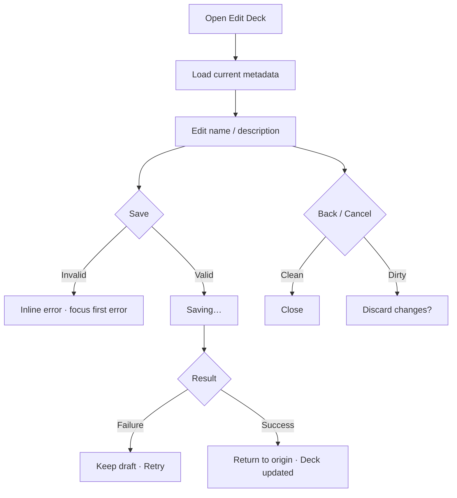

# Đặc tả UI/UX hoàn chỉnh — Edit Deck

Phạm vi tài liệu này mô tả chỉnh tên và description của Deck đã tồn tại. Move, Organise, Reset progress và Delete là flow riêng.

## 1. Nguyên tắc đã chốt

- Metadata edit không thay đổi cấu trúc hoặc nội dung Deck.
- Deck name bắt buộc; description optional.
- Tên được trim khi validate và persist.
- Root Deck unique trong Library; nested Deck unique trong cùng sibling context.
- Language pair hiển thị read-only; thay đổi context dùng `move-deck.md`.
- Save failure giữ toàn bộ draft; không autosave một phần form.

## 2. Entry points

| Context | Trigger | Presentation |
| --- | --- | --- |
| Empty/Leaf/Parent | More → Edit deck | Full-screen Settings form |
| Deck Settings | Rename/Edit metadata | Cùng form |
| Library selection một Deck | Edit | Full-screen Settings form |

# 3. Master flow



# 4. Objective, archetype và composition

- Objective: cập nhật metadata mà không thay đổi content hierarchy.
- Archetype: Settings/Form.
- Primary CTA duy nhất: `Save`.

```text
←  Edit deck

Deck name *
[ Korean TOPIK I                               ]

Description
[ Vocabulary and grammar for TOPIK I           ]

Language pair
Korean → Vietnamese                            read-only

                                               [ Save ]
```

Delete/Reset không đặt cạnh Save; chúng mở flow riêng từ lifecycle actions.

# 5. Field rules

## Deck name

- Empty: `Give your deck a name.`
- Too long: `Use a shorter deck name.`
- Duplicate root: `A deck with this name already exists in your Library.`
- Duplicate sibling: `A deck with this name already exists here.`
- Case/whitespace variants được xem là duplicate.
- Long valid name wrap ở preview; input vẫn hỗ trợ cursor/selection đầy đủ.

## Description

- Optional; blank được persist thành không có description.
- Trim khoảng trắng đầu/cuối; giữ line breaks có chủ đích.
- Không dùng description thay title hoặc chứa action cấu trúc.

## Language pair

- Hiển thị pair hiện tại; không editable trong flow này.
- Pair không còn tồn tại: chặn Save và cung cấp đường phục hồi qua Move/Language settings.

# 6. Submit lifecycle

- Idle: Save disabled khi clean hoặc invalid; fields editable.
- Invalid: giữ draft; focus field lỗi đầu tiên; announce inline.
- Saving: CTA `Saving…` giữ kích thước; disable fields, Back, double-submit.
- Failure: `Couldn’t update the deck. Your changes are still here. Try again.` + `Try again`.
- Success: persist name/description cùng một action; quay origin; snackbar `Deck updated`.
- Không mở card editor, Study hoặc một Deck khác.

# 7. Cancel và dirty draft

- Clean Back/Cancel đóng ngay.
- Dirty mở:

```text
Discard your changes?

Keep editing                              Discard
```

- `Keep editing` trả focus về field gần nhất.
- App background/foreground không tự discard draft.

# 8. Concurrent change

- Deck bị xóa trước Save: `This deck is no longer available.` và về Library.
- Metadata đổi từ nơi khác: không ghi đè im lặng; yêu cầu reload/review conflict.
- Parent context đổi: duplicate validation chạy theo context mới trước persist.

# 9. State matrix

- Loading; clean; dirty valid; empty/too-long/duplicate-root/duplicate-sibling.
- Description empty/long/multiline.
- Saving; failure; success; discard confirm; concurrent update/not found.
- Keyboard open; long localized text; large font; narrow device; light/dark.

# 10. Action matrix

| Condition | Save | Back | Fields |
| --- | ---: | ---: | ---: |
| Clean | Disabled | Có | Editable |
| Dirty valid | Primary | Có + confirm | Editable |
| Invalid | Disabled | Có + confirm | Editable |
| Saving | Progress | Disabled | Disabled |
| Failure | Try again | Có + confirm | Editable |

# 11. Acceptance criteria

- Save chỉ cập nhật name/description, không đổi pair hoặc hierarchy.
- Validation phân biệt duplicate root và sibling.
- Draft giữ qua validation và recoverable failure.
- Dirty Back có confirm; clean Back không có.
- Success cập nhật mọi nơi hiển thị title không cần relaunch.
- Keyboard không che Save; touch targets ≥44×44.
- Long text, large font, narrow width và dark mode không phá composition.
- Canonical Deck Settings states đạt parity dưới 3% cho từng theme.
