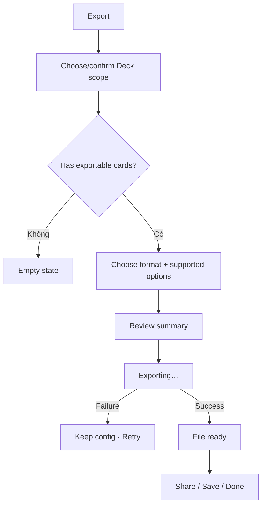

# Đặc tả UI/UX hoàn chỉnh — Export Deck

Phạm vi tài liệu này mô tả chọn Deck scope, cấu hình export, tạo file và return/share. Serialization chi tiết thuộc Export feature.

## 1. Nguyên tắc đã chốt

- Leaf export direct cards; Parent export aggregate descendant content theo cấu trúc.
- Empty Deck không có content để export và phải giải thích cách tiếp tục.
- Export là read-only: không thay đổi Deck, card hoặc progress.
- Scope và options được review trước khi tạo file.
- Export failure giữ toàn bộ config.
- File chỉ được coi là hoàn tất sau khi write thành công; không share file partial.

## 2. Entry points

| Context | Trigger | Preselected scope |
| --- | --- | --- |
| Deck Settings | Export | Current Deck |
| Parent actions | Export | Current subtree |
| Library selection | Export | Selected Deck(s) |
| Global Settings | Export | Chọn Deck bắt buộc |

# 3. Master flow



# 4. Objective, archetype và composition

- Objective: tạo một file đầy đủ từ Deck scope đã xác nhận.
- Archetype: Form.
- Primary CTA: `Export`.

```text
←  Export deck

Deck
<Deck name / selected count>                    Change

Format *
<available formats>

Options
<only options supported by selected format>

Summary
<deck count> decks · <card count> cards

                                               [ Export ]
```

# 5. Scope rules

- Leaf: current Deck cards.
- Parent: all descendant Leaf cards; hierarchy preserved khi format hỗ trợ.
- Multiple roots: mỗi root giữ boundary riêng.
- Empty-only selection: chặn Export.
- Mixed selection có Empty: cho tiếp tục với explicit summary Empty Decks excluded, hoặc yêu cầu include/exclude; không bỏ qua im lặng.
- Counts refresh trước submit.

# 6. Format/options contract

- Format required.
- Chỉ hiển thị options có hiệu lực với format hiện tại.
- Đổi format không giữ option không tương thích một cách ẩn.
- Preview/summary nêu content types được include; study progress chỉ include khi user chọn và format hỗ trợ.
- Filename được tạo an toàn từ Deck context nhưng user có thể nhận diện file.

# 7. Export lifecycle

- Config: editable; Export disabled khi scope/format invalid.
- Exporting: `Exporting…`; disable config, Back, double-submit; hiển thị progress cho workload lớn.
- Failure: `Couldn’t export the deck. Your options are still here. Try again.`
- Done: hiển thị file name/summary; primary `Share file`, secondary `Done` tùy platform capability.
- Share cancel không xóa file result trong current done state.

# 8. Cancel và stale data

- Clean Back đóng; dirty Back hỏi discard config.
- Deck bị xóa trước export: remove khỏi scope và yêu cầu review summary lại.
- Card count đổi: refresh summary trước submit; export snapshot nhất quán.
- Storage/share unavailable: phân biệt file-generation failure và share failure.

# 9. Error copy

| Case | Copy |
| --- | --- |
| Empty scope | `There are no cards to export from this deck.` |
| Missing format | `Choose a file format.` |
| Generate failure | `Couldn’t create the export file. Your options are still here.` |
| Share failure | `The file is ready, but it couldn’t be shared. Try sharing again.` |

# 10. State matrix

- Leaf config; Parent subtree; multi-select; Empty; mixed Empty.
- Format/options changes; large counts; exporting; generation error; done; share error.
- Stale/deleted scope; long name/filename/localized labels.
- Large font, narrow device, light/dark.

# 11. Action matrix

| State | Export | Change config | Back |
| --- | ---: | ---: | ---: |
| Valid config | Primary | Có | Có + dirty guard |
| Empty/invalid | Disabled | Có | Có |
| Exporting | Progress | Disabled | Disabled |
| Generate failure | Try again | Có | Có |
| Done | Share file | Không cần | Done |

# 12. Acceptance criteria

- Parent scope aggregate đúng và không double-count.
- Empty scope không tạo file rỗng không giải thích.
- Unsupported options không được apply ẩn.
- Failure giữ config; partial file không được share.
- Export không mutate business data.
- Generation/share failures có recovery khác nhau.
- Canonical Export states đạt parity dưới 3% mỗi theme.
