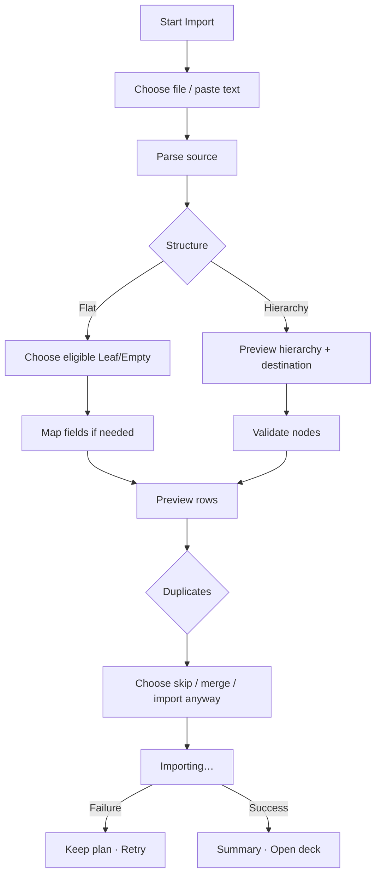

# Đặc tả UI/UX hoàn chỉnh — Import into Deck

Phạm vi tài liệu này mô tả contract từ Deck tới Import: chọn target/scope, flat hay hierarchical content, preview, commit và return. Parser/file-picker chi tiết thuộc Import feature.

## 1. Nguyên tắc đã chốt

- Flat cards chỉ vào Leaf hoặc Empty.
- Parent không nhận direct flat cards; phải chọn/create child.
- Hierarchical import giữ cấu trúc parent/leaf và preview trước confirm.
- Một imported node không được chứa đồng thời direct cards và child nodes.
- Source, mapping và duplicate choices được giữ qua recoverable failure.
- Write phase atomic theo confirmed import plan.
- Import không tự Study hoặc mở Card Editor.

## 2. Entry points

| Context | Content intent | Initial target |
| --- | --- | --- |
| Dashboard/Library | Unknown/file | Chọn sau parse/preview |
| Empty | Flat cards | Current Deck |
| Leaf | Flat cards | Current Deck |
| Parent | Flat cards | Chọn child hoặc create child |
| Parent/Library | Hierarchy | Current Parent hoặc Library root |
| First run | Existing content | Full-screen Import; không Create dialog |

# 3. Master flow



# 4. Objective, archetype và composition

- Objective: review và commit đúng content vào đúng Deck context.
- Archetype: Form/focused multi-step flow.
- Primary CTA tại preview: `Import`.

```text
←  Import

Source → Mapping → Preview

Target
<Deck path>                                      Change

<parsed rows / hierarchy preview>
<duplicate summary>

                                               [ Import ]
```

# 5. Target rules

## Flat cards

- Target picker dùng eligibility từ `add-content-to-deck.md`.
- Parent entry hiển thị:

```text
Choose where to import

Select a nested deck
Create a new nested deck
Cancel
```

- Child mới chỉ tạo khi user hoàn tất Create; cancel không đổi hierarchy.

## Hierarchical content

- Preview tree trước confirm.
- Parent nodes hiển thị deck count; Leaf nodes hiển thị card count.
- Node có cả direct cards và children phải được normalize bằng explicit user choice hoặc bị chặn; không tự đoán.
- Imported children kế thừa language pair của destination trừ khi flow yêu cầu map pair rõ ràng.

# 6. Mapping và validation

- Required card fields phải được map trước Import.
- Invalid/unreadable rows hiển thị row count và cách exclude/fix.
- Empty parsed source không cho Import.
- Destination stale/deleted/đổi thành Parent trước commit → yêu cầu chọn lại, giữ source/mapping.
- Long text preview wrap; không ellipsis term/meaning quan trọng.

# 7. Duplicate handling

| Choice | Behavior |
| --- | --- |
| Skip | Không ghi duplicate rows; summary nêu skipped count |
| Merge | Chỉ merge fields được Import feature hỗ trợ; preview nêu thay đổi |
| Import anyway | Tạo card riêng và cảnh báo rõ duplicate vẫn tồn tại |

- Không áp một choice ngầm khi duplicates được phát hiện.

# 8. Submit lifecycle

- Source: chọn file/paste; dirty Back có discard confirm.
- Mapping/Preview: Back giữ step trước và data.
- Importing: progress ổn định; chặn double-submit và target mutation.
- Cancel an toàn trước commit quay preview; nếu commit đã bắt đầu, chỉ cancel khi đảm bảo rollback.
- Failure: `Couldn’t import the cards. Your source and choices are still here.` + `Try again`.
- Success: summary `<imported> imported · <skipped> skipped`; action `Open deck`/`Done`.

# 9. Result và Deck transition

- Flat import vào Empty → Leaf.
- Flat import vào Leaf → Leaf, cập nhật card count.
- Hierarchy vào Empty/Parent → Parent khi có child imported.
- Import 0 card sau skip không đổi Deck type.
- Không render mixed direct card/child state.

# 10. Error copy

| Case | Copy |
| --- | --- |
| Parse | `We couldn’t read this source. Check the file or paste the content again.` |
| Mapping | `Choose where the term and meaning come from.` |
| No rows | `There are no cards to import.` |
| Invalid target | `Choose a leaf or empty deck for these cards.` |
| Commit | `Couldn’t import the cards. Nothing has been added.` |

# 11. State matrix

- Source/file/paste; parent-target; mapping; preview; duplicate warning.
- Hierarchy shallow/deep/mixed-node invalid.
- Importing/cancel-safe/failure/done; target stale.
- Empty source/invalid rows/large file/long text.
- Keyboard, large font, narrow device, light/dark.

# 12. Acceptance criteria

- Flat import không thể target Parent.
- Hierarchy preview giữ parent/leaf structure và không tạo mixed nodes.
- Source/mapping/duplicate choice giữ qua failure.
- Commit atomic; failure copy xác nhận không thêm partial data.
- Deck transition đúng theo imported result, không theo intent ban đầu.
- Done không tự Study/Card Editor.
- Canonical Import states đạt parity dưới 3% mỗi theme.
