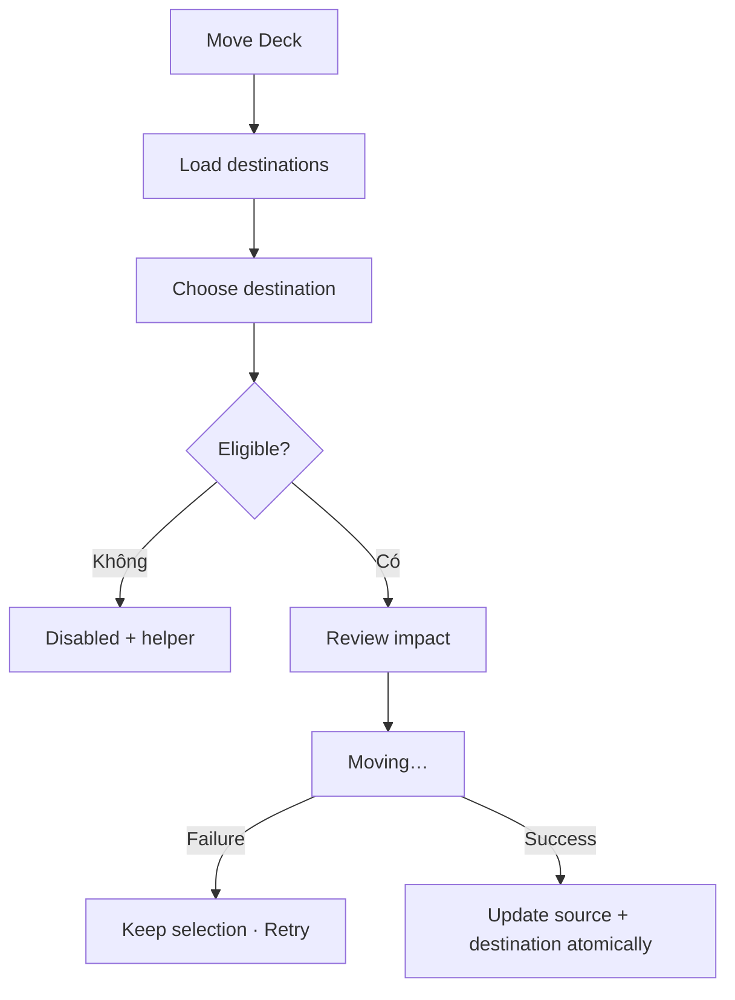

# Đặc tả UI/UX hoàn chỉnh — Move Deck

Phạm vi tài liệu này mô tả di chuyển Deck trong hierarchy hoặc sang language-pair context hợp lệ. Không mô tả reorder bằng drag-and-drop.

## 1. Nguyên tắc đã chốt

- Move giữ id, content, learning progress và metadata.
- Không move vào chính nó hoặc descendant.
- Destination không được là Leaf có direct card.
- Destination có thể là Library root, Parent hoặc Empty; Empty thành Parent sau success.
- Nested Deck phải cùng language pair với parent; cross-pair move đổi toàn subtree như một đơn vị.
- Tên unique trong destination sibling context.
- Move atomic; không có trạng thái xuất hiện ở cả hai nơi hoặc mất khỏi cả hai.

## 2. Entry points

| Context | Trigger | Presentation |
| --- | --- | --- |
| Deck Settings | Move | Destination selection |
| Parent child action | Move | Destination selection |
| Library selection một Deck | Move | Destination selection |

# 3. Master flow



# 4. Objective, archetype và composition

- Objective: chọn destination hợp lệ cho Deck.
- Archetype: Selection.
- Primary CTA: `Move here` sau khi chọn.

```text
←  Move deck

Moving
<Deck name>

Choose a destination
○ Library
○ <Parent deck>
  ○ <Nested parent>
○ <Empty deck>
⊘ <Leaf deck>                         Contains cards
⊘ <Current deck>                      This deck

                                          [ Move here ]
```

# 5. Destination eligibility

| Destination | Allowed | Rule |
| --- | ---: | --- |
| Library root | Có | Thành root |
| Parent cùng pair | Có | Thêm vào child list |
| Empty cùng pair | Có | Target thành Parent |
| Leaf | Không | Không trộn cards/children |
| Self/descendant | Không | Chặn cycle |
| Deleted | Không | Reload |
| Khác pair | Có điều kiện | Confirm toàn subtree đổi pair |

# 6. Language pair change

- Child pair inherited; không có mixed-pair subtree.
- Confirm hiển thị pair cũ → mới và số descendants/cards ảnh hưởng.
- Không dịch card text tự động.
- Cancel confirm quay selection và giữ destination.

# 7. Validation copy

| Trường hợp | Copy |
| --- | --- |
| Self | `A deck can’t be moved inside itself.` |
| Descendant | `Choose a destination outside this deck.` |
| Leaf target | `This deck contains cards and can’t receive a nested deck.` |
| Duplicate | `A deck with this name already exists there.` |
| Stale target | `That destination is no longer available. Choose another one.` |

# 8. Submit lifecycle

- Idle: CTA disabled khi chưa chọn/invalid.
- Submitting: `Moving…`; disable list, Back và double-submit.
- Failure: `Couldn’t move the deck. Nothing has changed. Try again.`; giữ selection.
- Success: snackbar `Deck moved`; highlight tại destination nếu đang visible; không tự mở moved Deck.

# 9. Aftermath

- Source parent mất child cuối → Empty; còn child → Parent.
- Destination Empty → Parent; Parent cập nhật counts.
- Source trở lại Empty không giữ mode Parent cũ; content đầu tiên tiếp theo quyết định loại mới.
- Root moved vào nested biến mất khỏi root list.
- Back về origin còn tồn tại và render state mới.

# 10. Cancel và concurrent change

- Cancel trước submit không đổi dữ liệu.
- Destination thành Leaf/bị xóa trước submit: chặn và reload.
- Subtree thay đổi khi picker mở: refresh impact trước confirm.

# 11. State matrix

- Loading; root/parent/empty target; leaf/self/descendant disabled.
- Deep/dense hierarchy; pair confirm; duplicate; stale/offline.
- Submitting/failure/success; long names/pairs; large font; narrow device; light/dark.

# 12. Acceptance criteria

- Valid targets loại self, descendants và Leaf.
- Move bảo toàn id/content/progress và internal order.
- Cross-pair áp dụng toàn subtree, không dịch card.
- Duplicate dùng destination context.
- Source/destination state cập nhật đúng và atomic.
- Move không được tạo mixed content; Empty/Leaf/Parent luôn được suy ra lại từ content sau commit.
- Failure giữ selection; canonical move states parity dưới 3% mỗi theme.
