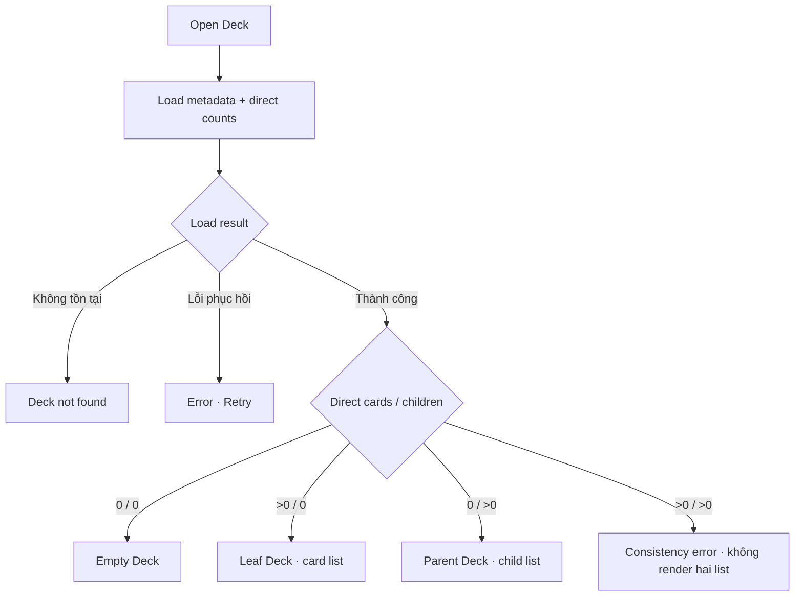

# Đặc tả UI/UX hoàn chỉnh — Open Deck

Phạm vi tài liệu này mô tả cách mở một Deck đã tồn tại và phân nhánh sang Empty, Leaf hoặc Parent. Không mô tả CRUD card, chỉnh metadata hoặc Study session.

Tài liệu này triển khai [canonical content-state contract](./README.md#0-canonical-content-state-contract); nếu có khác biệt, contract trong `README.md` được ưu tiên.

## 1. Nguyên tắc đã chốt

- Trạng thái Deck được suy ra tại thời điểm đọc, không phải lựa chọn cố định của user.
- Empty Deck: không có direct card và không có child deck.
- Leaf Deck: có direct card và không có child deck.
- Parent Deck: không có direct card và có ít nhất một child deck.
- Không màn nào hiển thị đồng thời direct card list và child deck list.
- Nếu dữ liệu có cả direct card và child deck, không đoán nhánh; hiển thị recoverable consistency error.
- Mỗi lần quay lại foreground, refresh hoặc nhận thay đổi dữ liệu phải phân loại lại.
- Mở Deck không tự động Study, Add Card, Import hoặc mở child đầu tiên.

## 2. Entry points

| Context | Trigger | Destination |
| --- | --- | --- |
| Library root | Tap Deck | Deck hiện tại |
| Parent Deck | Tap child Deck | Child Deck |
| Dashboard | Tap recent/active Deck | Deck hiện tại |
| Search | Tap Deck result | Deck hiện tại |
| Create/Import success | `Open deck` | Deck liên quan |
| Study result | `Back to deck` | Deck đã Study |
| Deep link hợp lệ | Open Deck link | Deck được định danh |

# 3. Master flow



# 4. Objective và archetype

- Objective: đưa user tới đúng nội dung và đúng action của Deck hiện tại.
- Empty: Detail; primary CTA `Add card`.
- Leaf: List; primary CTA `Add card`.
- Parent: List; primary CTA `Create deck`.
- Loading/error/not-found giữ app-bar context để user biết Deck nào đang được mở.

# 5. Composition theo trạng thái

## Empty Deck

```text
←  <Deck name>                                      More

This deck is empty
Add cards directly, or create its first nested deck.

[ Add card ]
  Create nested deck
  Import cards
```

## Leaf Deck

```text
←  <Deck name>                         Search       More
<card count> cards
[ Card list ]
                                             + Add card
```

## Parent Deck

```text
←  <Deck name>                         Search       More
<child count> nested decks · <aggregate card count> cards
[ Child deck list ]
                                           + Create deck
```

## Không xuất hiện

- Empty không hiển thị list rỗng giả.
- Leaf không hiển thị Create nested deck trực tiếp.
- Parent không hiển thị Add Card hoặc direct card rows.
- Không hiển thị selector `Default view` hay Cards/Nested decks.

# 6. Load lifecycle

- Loading: giữ app bar ổn định; dùng skeleton đúng archetype; ẩn action phụ thuộc loại Deck.
- Recoverable failure: `Couldn’t open this deck. Try again. Your library hasn’t changed.` + `Try again`.
- Not found: `This deck is no longer available.` + `Back to Library`.
- Consistency error: `Cards and nested decks can’t be shown together.` + `Refresh`.
- Không cho Add, Import, Move hoặc Study khi consistency error còn tồn tại.

# 7. Refresh và state transition

- Empty + card đầu tiên thành công → Leaf.
- Empty + child đầu tiên thành công → Parent.
- Leaf mất card cuối cùng → Empty.
- Parent mất/move child cuối cùng → Empty.
- Khi trở lại Empty, không giữ loại Leaf/Parent cũ; nội dung đầu tiên tiếp theo quyết định loại mới.
- Parent aggregate count đổi không làm đổi loại nếu vẫn còn child.
- Transition cập nhật tại chỗ; không push thêm bản sao cùng route.

# 8. Back và preservation

- Back quay về đúng origin và giữ scroll/search/filter của origin.
- Từ deep nested Deck, Back về parent trực tiếp trước Library root.
- Nếu Deck bị xóa khi đang mở, chuyển Not found; Back về context gần nhất còn tồn tại.
- Refresh không làm mất scroll nếu loại Deck không đổi.

# 9. Error copy

| Trường hợp | Copy |
| --- | --- |
| Load failure | `Couldn’t open this deck. Try again.` |
| Not found | `This deck is no longer available.` |
| Mixed direct content | `Cards and nested decks can’t be shown together.` |
| Parent Add Card attempt | `Choose one of this deck’s nested decks.` |
| Leaf Create child attempt | `Move or delete all cards before creating a nested deck.` |

# 10. State matrix

- Loading; Empty; Leaf minimum/normal/dense; Parent minimum/normal/dense/deep.
- Recoverable error; Not found; Consistency error.
- Long name/localized metadata; large font; narrow device; light/dark.

# 11. Action visibility matrix

| State | Add card | Create child | Import flat | Study | Search |
| --- | ---: | ---: | ---: | ---: | ---: |
| Empty | Primary | Secondary | Tertiary | Disabled | Không |
| Leaf | Primary | Không | Có | Có | Có |
| Parent | Không | Primary | Chọn child | Aggregate | Child decks |
| Error/not-found | Không | Không | Không | Không | Không |

# 12. Acceptance criteria

- Mỗi lần mở đều phân loại theo direct card/child counts hiện tại.
- Empty, Leaf và Parent có action đúng matrix.
- Parent chỉ render child list; Leaf chỉ render card list.
- Mixed content không được persist hoặc render như trạng thái bình thường; dữ liệu đã vi phạm chỉ hiện consistency error và action phục hồi.
- Leaf không có direct conversion sang Parent và không có action `Organise into nested decks`.
- Deck đã mất nội dung cuối cùng được phân loại lại là Empty, không giữ mode cũ.
- Back giữ origin context; refresh không tạo duplicate route.
- Transition sau add/delete/move phản ánh ngay.
- Long text, large font, narrow device và dark mode không che heading/action.
- Mọi canonical state có reference đạt parity dưới 3% cho từng theme.
