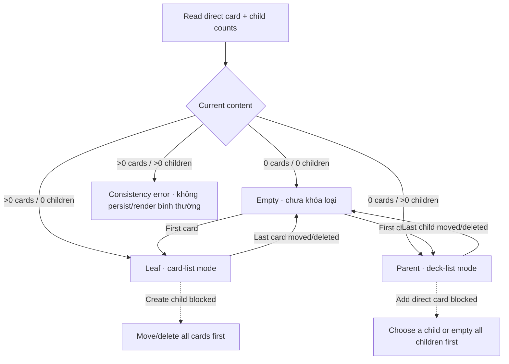

# Đặc tả UI/UX hoàn chỉnh — Organise Deck

Phạm vi tài liệu này sở hữu guard và chuyển trạng thái nội dung sau khi Deck tồn tại. Tài liệu tuân theo [canonical content-state contract](./README.md#0-canonical-content-state-contract). Tạo mới thuộc `create-deck.md`; CRUD Card/Deck con thuộc flow tương ứng.

## 1. Business invariants

- Empty = 0 direct card và 0 child; Leaf = có direct card và 0 child; Parent = 0 direct card và có child.
- Trạng thái được suy ra từ nội dung hiện tại; không persist một mode độc lập có thể bị stale.
- Empty chưa khóa loại nội dung: card đầu tiên tạo Leaf, child đầu tiên tạo Parent.
- Leaf không được tạo child; Parent không được tạo direct card.
- Không hỗ trợ direct Leaf → Parent conversion và không có action `Organise into nested decks`.
- Muốn đổi Leaf sang Parent, user phải di chuyển hoặc xóa hết direct card để Deck trở lại Empty, sau đó mới tạo child đầu tiên.
- Tương tự, muốn đổi Parent sang Leaf, user phải di chuyển hoặc xóa hết child để Deck trở lại Empty, sau đó mới tạo card đầu tiên.
- Mixed content là dữ liệu không hợp lệ; không persist hoặc render như trạng thái bình thường.
- Không có switch `Cards/Nested decks`, `Default view` hoặc mode cũ được giữ lại khi Deck đã Empty.

## 2. Entry points và kết quả

| Current state | Trigger thành công | Result |
| --- | --- | --- |
| Empty | Add/import card đầu tiên | Leaf |
| Empty | Create/move/import child đầu tiên | Parent |
| Leaf | Delete/move card cuối cùng ra ngoài | Empty |
| Parent | Delete/move child cuối cùng ra ngoài | Empty |
| Leaf | Attempt tạo/move child vào | Bị chặn; yêu cầu đưa toàn bộ card ra trước |
| Parent | Attempt tạo/move direct card vào | Bị chặn; yêu cầu chọn child hoặc đưa toàn bộ child ra trước |

# 3. Master flow

# 4. Empty Deck choice

- Objective: cho user chọn loại nội dung đầu tiên tại đúng context.
- Archetype: Detail.
- Primary CTA `Add card`; secondary `Create nested deck`; tertiary `Import cards`.
- Add/import card thành công mới chuyển sang Leaf.
- Create/move/import child thành công mới chuyển sang Parent.
- Cancel hoặc failure giữ Empty; không khóa lựa chọn đã thử.

# 5. Leaf guard và đường chuyển hợp lệ

- Leaf chỉ hiển thị và quản lý direct cards.
- Create/move child vào Leaf bị chặn trước persist.
- Error copy: `Move or delete all cards before creating a nested deck.`
- Không cung cấp dialog chuyển đổi, action overflow hay transaction tự tạo child rồi chuyển card.
- Sau khi card cuối cùng được move/delete thành công, cùng route render Empty; lúc đó user có thể tạo child đầu tiên.
- Failure khi move/delete card cuối giữ Leaf và card hiện tại.

# 6. Parent guard và đường chuyển hợp lệ

- Parent chỉ hiển thị và quản lý child Decks.
- Add/import/move direct card vào Parent bị chặn trước persist.
- Error copy: `Choose one of this deck’s nested decks.`
- Sau khi child cuối cùng được move/delete thành công, cùng route render Empty; lúc đó user có thể tạo card đầu tiên.
- Failure khi move/delete child cuối giữ Parent và child hiện tại.

# 7. Transition và consistency boundary

1. Re-read direct card và child counts ngay trước commit.
2. Validate operation không tạo mixed content.
3. Commit content membership và count projection atomically.
4. Suy ra lại Empty/Leaf/Parent từ counts sau commit.
5. Render trạng thái mới; không persist hoặc khôi phục mode cũ riêng biệt.

Nếu dữ liệu đã có cả direct card và child, chặn Add/Create/Move/Import/Study, hiển thị consistency error và chỉ cho Refresh hoặc recovery flow được chỉ định. UI không được hiển thị hai list cùng lúc.

# 8. Invalid action guards

| Attempt | Result |
| --- | --- |
| Leaf tạo/move child vào | Chặn; yêu cầu move/delete toàn bộ card để trở lại Empty |
| Parent add/import/move direct card vào | Chặn; yêu cầu chọn child |
| Empty thêm card đầu tiên | Cho phép; success → Leaf |
| Empty thêm child đầu tiên | Cho phép; success → Parent |
| Concurrent operation làm loại Deck thay đổi | Reload, revalidate và giữ input/source nếu có thể retry |
| Mixed content | Consistency error; không render/persist như trạng thái bình thường |

# 9. Cancel, failure và concurrent change

- Cancel Card/Import/Create/Move khi Deck Empty không thay đổi trạng thái.
- Operation failure giữ nguyên content và loại suy ra trước operation.
- Nếu Deck đổi loại trong lúc action đang mở, chặn submit, reload và giải thích target không còn hợp lệ.
- Không tự động xóa, move hoặc gom content để thỏa điều kiện của action khác.

# 10. State matrix

- Empty default/add-card/create-child/import/action failure/success.
- Leaf loaded/minimum/dense/last-card move-delete/failure/returned Empty/create-child blocked.
- Parent loaded/minimum/dense/last-child move-delete/failure/returned Empty/add-card blocked.
- Mixed-content consistency error; stale/concurrent state.
- Long name/count/localized text; keyboard; large font; narrow device; light/dark.

# 11. Action visibility matrix

| State | Add card | Create child | Import flat | Import hierarchy |
| --- | ---: | ---: | ---: | ---: |
| Empty | Primary | Secondary | Có | Có |
| Leaf | Primary | Không | Có | Không |
| Parent | Không | Primary | Chọn child | Có |
| Mixed/error | Không | Không | Không | Không |

# 12. Acceptance criteria

- Loại Deck luôn được suy ra từ content hiện tại và chỉ đổi sau operation thành công.
- Empty cho phép card đầu tiên hoặc child đầu tiên quyết định loại nội dung.
- Leaf không thể nhận child; Parent không thể nhận direct card.
- Không có direct Leaf → Parent conversion hoặc action `Organise into nested decks`.
- Xóa/move nội dung cuối cùng đưa Deck về Empty và không giữ mode cũ.
- Mixed content không được tạo, persist hoặc render như trạng thái bình thường.
- Failure rollback membership/counts; retry không tạo duplicate state.
- Action đúng matrix, copy nêu cách phục hồi.
- Empty/Leaf/Parent/guard/error canonical states đạt parity dưới 3% mỗi theme.
