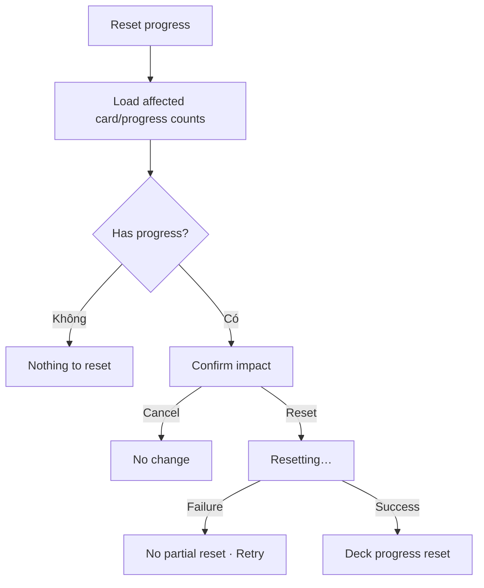

# Đặc tả UI/UX hoàn chỉnh — Reset Deck Progress

Phạm vi tài liệu này mô tả reset learning progress của cards trong Deck scope. Không xóa Deck, card, content metadata hoặc app-wide study settings.

## 1. Nguyên tắc đã chốt

- Reset là destructive đối với progress và luôn cần confirmation.
- Leaf reset direct cards; Parent reset descendant cards.
- Empty không có progress để reset.
- Card content, translations, tags, audio và hierarchy giữ nguyên.
- Reset atomic cho confirmed scope.
- Không tự bắt đầu session sau reset.
- Copy phải phân biệt Reset progress với Delete Deck.

## 2. Entry points

| Context | Trigger | Scope |
| --- | --- | --- |
| Deck Settings | Reset progress | Current Deck/subtree |
| Parent child action | Reset child progress | Child subtree |
| Library selection một Deck | Reset progress | Selected Deck |

# 3. Master flow



# 4. Objective, archetype và composition

- Objective: xác nhận đúng Deck scope trước khi đưa progress về trạng thái chưa học.
- Archetype: Destructive confirmation.
- Safe action `Keep progress`; destructive action `Reset progress`.

```text
Reset learning progress?

This will reset progress for <affected count> cards in “<Deck name>”.
Your cards and nested decks will stay in place.

Keep progress                        Reset progress
```

Parent bổ sung `<descendant count> nested decks` trong impact summary.

# 5. Scope và impact

- Affected count chỉ gồm cards có progress cần reset; total card count hiển thị nếu giúp hiểu context.
- Parent aggregate toàn descendants, không direct cards.
- Hidden cards vẫn thuộc scope nếu có progress, trừ khi product contract loại rõ.
- Active session không bị silently rewrite: chặn reset hoặc yêu cầu kết thúc session trước.
- Counts refresh trước submit; impact đổi yêu cầu confirm lại.

# 6. Reset semantics

- Xóa/đưa scheduling state về initial chưa học theo Study domain.
- Xóa due/interval/ease/repetition/lapse state thuộc cards trong scope.
- Không đổi card order/content, Deck counts hoặc hierarchy.
- App-wide streak/history không bị sửa trừ khi product có policy riêng; tài liệu này không cấp quyền reset chúng.

# 7. Lifecycle

- Loading impact: chưa cho confirm.
- Nothing to reset: `This deck has no learning progress to reset.` + Close.
- Resetting: `Resetting…`; disable dismiss/Back/double-submit.
- Failure: `Couldn’t reset the progress. Nothing has changed. Try again.`
- Success: snackbar `Deck progress reset`; giữ user ở Settings/origin; due/new summaries refresh.

# 8. Cancel và accessibility

- Keep/Back/scrim trước submit đóng, no change.
- Safe action focus mặc định; destructive label không chỉ dựa màu.
- Impact text/count wrap; announce submitting/success/failure.

# 9. Concurrent/offline

- Local reset hoạt động offline.
- Cards thêm/xóa khi dialog mở: refresh affected count.
- Deck bị delete: đóng flow và về surviving context.
- Transaction failure rollback toàn scope.
- Không cho hai reset cùng Deck chạy đồng thời.

# 10. State matrix

- Leaf with progress; Parent shallow/deep aggregate; Empty/no progress.
- Impact loading/changed; active-session blocked.
- Resetting/failure/success/not found.
- Large counts/long name/localized copy; large font; narrow device; light/dark.

# 11. Action matrix

| State | Keep | Reset | Dismiss |
| --- | ---: | ---: | ---: |
| Has progress | Safe | Destructive | Có |
| No progress | Close | Disabled | Có |
| Impact changed | Safe | Confirm lại | Có |
| Resetting | Disabled | Progress | Disabled |
| Failure | Safe | Try again | Có |

# 12. Acceptance criteria

- Reset không xóa Deck/card/hierarchy hoặc đổi metadata.
- Leaf/Parent scope đúng và không double-count.
- Empty/no-progress không chạy transaction.
- Active session được xử lý rõ, không silently mutate queue.
- Failure rollback toàn scope; success refresh due/new summaries.
- Copy phân biệt rõ Reset và Delete.
- Canonical reset-confirm states đạt parity dưới 3% mỗi theme.
