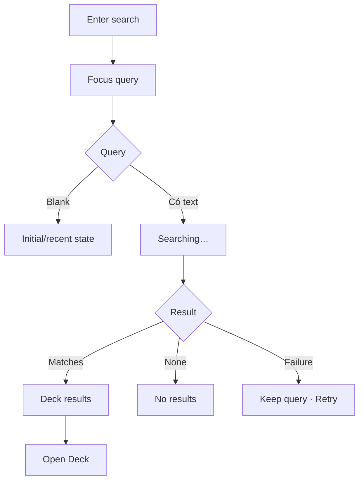

# Đặc tả UI/UX hoàn chỉnh — Search Decks

Phạm vi tài liệu này mô tả tìm Deck tại Library root, trong Parent hoặc global Search. Card-result behavior thuộc Search/Flashcard feature.

## 1. Nguyên tắc đã chốt

- Search không thay đổi hierarchy hoặc selection target.
- Query được trim; blank query hiển thị initial/recent context, không phải no-results.
- Library search tìm root Deck; Parent search tìm direct children; Global search có thể tìm Deck mọi depth.
- Result luôn kèm path/language pair đủ để phân biệt tên giống nhau ở context khác.
- Tap result mở qua `open-deck.md`.
- Search failure không xóa query.

## 2. Entry points

| Entry | Scope | Presentation |
| --- | --- | --- |
| Library search | Root Decks | In-place search mode |
| Parent search | Direct children | In-place search mode |
| Global Search | All Decks | Full-screen Search |
| Target picker search | Eligible destinations/targets | Scoped selection search |

# 3. Master flow



# 4. Objective, archetype và composition

- Objective: tìm và mở đúng Deck bằng name/description/context.
- Archetype: Search.
- Không có competing primary CTA; result row là navigation action.

```text
←  [ Search decks…                              × ]

DECKS
[ Korean TOPIK I ]
  Library · Korean → Vietnamese · 486 cards

[ Grammar ]
  Korean TOPIK I / Grammar · 120 cards
```

# 5. Matching và ranking contract

- Match trên Deck name; description là supporting match.
- Exact/prefix name đứng trước partial description match.
- Trong scoped search, không trả Deck ngoài scope.
- Deleted Deck không còn trong results sau refresh.
- Kết quả ổn định với cùng query/data; không phụ thuộc theme hoặc viewport.

# 6. Result row

- Title không ellipsis thông tin phân biệt quan trọng; cho wrap.
- Supporting path hiển thị Library/ancestors khi cần.
- Count phản ánh direct/aggregate theo loại Deck.
- Parent/Leaf/Empty có semantic label khi search dùng cho target selection.
- Không hiển thị action mutate trực tiếp trong global result row.

# 7. Search lifecycle

- Initial: focus query; global có recent searches nếu tồn tại.
- Searching: skeleton/status không thay app-bar size.
- Results: announce result count.
- No results: `Nothing matched “<query>”. Check the spelling or try a different term.`
- Failure: `Couldn’t search your decks. Your query is still here.` + `Try again`.
- Clear: xóa query và trở initial state.

# 8. Back và preservation

- Back từ active query về origin và giữ origin scroll/filter.
- Back trong result Deck rồi quay lại Search giữ query và scroll results.
- Scoped search đóng về cùng Parent/Library level.
- Không persist sensitive pasted query ngoài recent-search policy.

# 9. Eligibility overlays

- Trong Add Card target: Parent disabled dù match query.
- Trong Move destination: Leaf/self/descendant disabled dù match.
- Disabled result có helper giải thích; không biến mất nếu user cần hiểu lý do.
- Global browse search không disable theo mutate eligibility.

# 10. State matrix

- Empty/recent; typing; loading; results; filtered; no-results; failure.
- Root/Parent/Global/target-picker scopes.
- One/dense results; duplicate names with distinct paths.
- Long query/title/path, large font, narrow device, keyboard, light/dark.

# 11. Acceptance criteria

- Scope root/direct-child/global được giữ chính xác.
- Blank query không hiển thị no-results.
- Query giữ qua failure và round-trip mở result.
- Result có đủ path/context để phân biệt.
- Eligibility trong picker đúng flow sở hữu.
- Keyboard không che results/clear; state announcements accessible.
- Canonical Library/Search states đạt parity dưới 3% mỗi theme.
