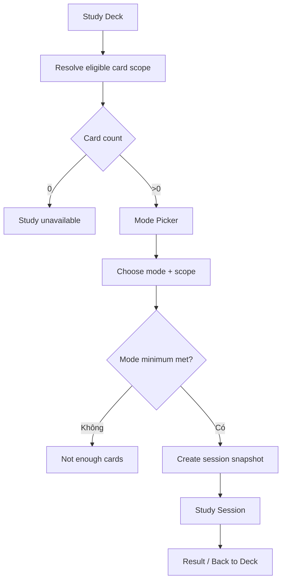

# Đặc tả UI/UX hoàn chỉnh — Study Deck

Phạm vi tài liệu này mô tả Deck-owned contract để bắt đầu Study: eligibility, aggregate scope, mode/scope handoff và return. Stage/session behavior thuộc Study feature.

## 1. Nguyên tắc đã chốt

- Empty không thể Study.
- Leaf Study direct cards.
- Parent Study aggregate cards từ descendant Leaves; không có direct cards.
- Eligibility dựa trên current data và yêu cầu tối thiểu của mode.
- Chọn Study không tự tạo/mutate content.
- Một session nhận immutable start scope; thay đổi Deck sau khi session bắt đầu không silently đổi queue.
- Kết quả Study quay đúng Deck context.

## 2. Entry points

| Context | Trigger | Initial scope |
| --- | --- | --- |
| Leaf | Study | Current Deck cards |
| Parent | Study all | Current subtree aggregate |
| Child row action | Study | Selected child subtree |
| Library Deck card | Study | Selected Deck |
| Dashboard due state | Review | Due cards theo dashboard contract |

# 3. Master flow



# 4. Objective, archetype và composition

- Objective: chọn mode/scope hợp lệ và bắt đầu session.
- Archetype: Selection.
- Primary CTA: `Start session`.

```text
←  Study <Deck name>

Scope
<Current deck / entire subtree>                  Change

<eligible card count> cards
<due/new breakdown when available>

Choose a mode
[ Mode options ]

                                       [ Start session ]
```

# 5. Scope rules

| Deck type | Default scope | Allowed |
| --- | --- | --- |
| Empty | None | Study disabled |
| Leaf | Direct cards | Current Deck |
| Parent | Entire subtree | Entire subtree hoặc eligible child subtree |

- Parent aggregate không double-count card.
- Hidden/excluded cards tuân theo Study eligibility, không chỉ raw count.
- Scope label luôn nêu path khi chọn deep child.
- Scope đổi phải recalculate mode eligibility.

# 6. Mode eligibility

- Mode Picker chỉ hiển thị/enable modes product hỗ trợ.
- Mode có minimum card count riêng; insufficient state nêu required/current và cách thêm/chọn scope khác.
- Guess yêu cầu candidate pool có ít nhất năm Card với năm meaning hiển thị khác nhau sau normalize trong cùng language pair, để mọi question luôn có một correct + bốn distractor.
- Nếu không đạt Guess minimum, không cho Start; mọi Guess question vẫn bắt buộc đúng năm lựa chọn.
- Review có thể dựa due queue; zero due hiển thị no-due choice theo Study contract, không giả tạo due cards.
- Không auto-switch mode khi current selection invalid.

# 7. Start lifecycle

- Loading eligibility: giữ heading, disable Start.
- Invalid/no cards: `This deck doesn’t have any cards to study yet.`
- Not enough: `Add more cards or choose a larger scope for this mode.`
- Guess not enough: `Guess needs at least 5 cards with different meanings.`
- Starting: `Starting…`; disable mode/scope/Back/double-submit.
- Failure: `Couldn’t start the session. Your mode and scope are still selected.` + Retry.
- Success: handoff session id + immutable scope; không giữ duplicate Mode Picker trong stack.

# 8. Return behavior

- Finish → Study Result; `Back to deck` về Deck khởi tạo.
- Exit confirm/progress save thuộc Study session.
- Deck bị move trong session: return theo Deck id tới location mới.
- Deck bị delete trong session: result cho về Library, không route not-found loop.
- Updated progress/count phản ánh khi quay lại Deck.

# 9. Concurrent/offline

- Local Study hoạt động offline khi content đã có.
- Card bị delete giữa eligibility và Start: revalidate snapshot.
- Deck state Leaf/Parent đổi trước Start: recalculate scope và yêu cầu review.
- Failure tạo session record không được để orphan active session.

# 10. State matrix

- Leaf/Parent/default scope/scope dropdown.
- Empty/no eligible cards/no due/not enough for mode.
- Deep child scope; large aggregate; loading; starting; failure; success handoff.
- Long name/path/mode copy; large font; narrow device; light/dark.

# 11. Action visibility matrix

| State | Study | Scope picker | Start |
| --- | ---: | ---: | ---: |
| Empty | Disabled | Không | Không |
| Leaf eligible | Có | Current only | Theo mode |
| Parent eligible | Aggregate | Có | Theo mode |
| Not enough | Có | Có | Disabled |
| Starting | Progress | Disabled | Disabled |

# 12. Acceptance criteria

- Empty không bắt đầu session; Leaf direct; Parent aggregate descendants.
- Mode minimum revalidate khi scope đổi.
- Guess eligibility kiểm tra cả Card count và ít nhất năm meaning khác nhau; duplicate meaning không được tính để lấp đủ năm option.
- Session start snapshot nhất quán và không orphan khi failure.
- Retry giữ mode/scope; return dùng Deck id, không stale path.
- No-due/not-enough copy nêu recovery.
- Canonical Mode Picker states đạt parity dưới 3% mỗi theme.
