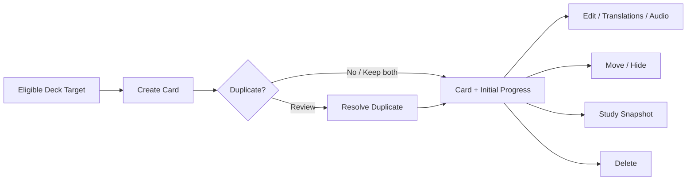

# Flashcard business flows

Flashcard sở hữu learning content trực tiếp trong Leaf/Empty Deck. Deck quyết định target eligibility; Learning Progress sở hữu scheduling state.

## Invariants

- Card chỉ thuộc Leaf hoặc Empty target; save card đầu tiên biến Empty thành Leaf.
- Card không thuộc Parent trực tiếp.
- Required term/meaning theo language context phải validate trước save.
- Additional translations có thứ tự ổn định.
- Duplicate detection không tự ghi đè content.
- Move giữ content/progress và phải chọn target hợp lệ.
- Delete content và progress liên quan là atomic.

## Primary Flashcard flow

Deck sở hữu target eligibility; Flashcard sở hữu content lifecycle; Learning Progress sở hữu scheduling; Study Session tiêu thụ snapshot.

## Flow catalog

| File | Flow sở hữu | Trạng thái |
| --- | --- | --- |
| [create-flashcard.md](./create-flashcard.md) | Tạo Card, validation, audio state và save lifecycle | Đã có |
| [edit-flashcard.md](./edit-flashcard.md) | Chỉnh content và dirty-draft behavior | Đã có |
| [resolve-duplicate-flashcard.md](./resolve-duplicate-flashcard.md) | Detect/review/keep-both/merge decision | Đã có |
| [move-flashcard.md](./move-flashcard.md) | Chọn Leaf/Empty target và atomic move | Đã có |
| [hide-flashcard.md](./hide-flashcard.md) | Ẩn/hiện Card khỏi Study eligibility | Đã có |
| [delete-flashcard.md](./delete-flashcard.md) | Impact, confirm và delete | Đã có |
| [manage-card-translations.md](./manage-card-translations.md) | Add/edit/reorder/remove additional meanings | Đã có |
| [manage-card-audio.md](./manage-card-audio.md) | Generate/attach/play/remove audio reference | Đã có |

## Cross-object contracts

- Nhận eligible Deck target từ `deck/add-content-to-deck.md`.
- Trả card-count transition cho Deck sau create/move/delete.
- Gửi answerable content snapshot cho Study Session.
- Learning Progress xóa/move theo Card id, không theo row position.

## Canonical state coverage

- Create/edit/validation/duplicate/submitting/failure/success.
- List minimum/dense/search/filter/selection/actions/delete.
- Long multilingual text, missing/broken audio, keyboard, large font, narrow, light/dark.
