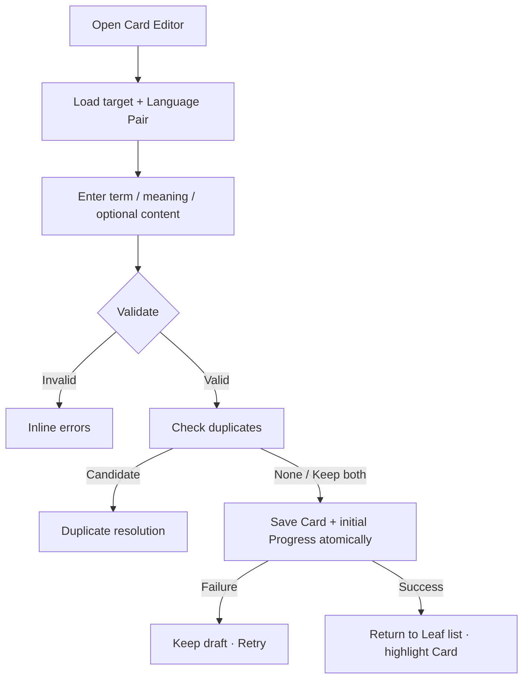

# Đặc tả UI/UX hoàn chỉnh — Create Flashcard

Flow này sở hữu tạo Card content trong một eligible Empty/Leaf Deck. Deck target selection và Learning Progress initialisation là linked contracts.

## 1. Nguyên tắc đã chốt

- Target phải là Empty hoặc Leaf tại thời điểm Save; Parent không hợp lệ.
- Term và primary meaning bắt buộc theo Language Pair context.
- Additional translations, tags và audio optional.
- Duplicate detection chạy trước commit nhưng không tự ghi đè.
- Card + child content + initial Progress được commit trong một consistency boundary.
- Empty chỉ chuyển Leaf sau Save thành công.
- Empty không giữ mode cũ; card đầu tiên thành công mới quyết định Card-list mode / Leaf.
- Save failure giữ toàn bộ draft.

## 2. Entry points

| Context | Target behavior |
| --- | --- |
| Empty/Leaf local Add | Current Deck |
| Dashboard/global Add | Target từ picker |
| Import review Add manually | Explicit eligible target |
| No valid target | Create/select Deck trước Editor |

# 3. Master flow



# 4. Objective, archetype và composition

- Objective: tạo một Card học được trong target Deck.
- Archetype: Form.
- Primary CTA: `Save`.

```text
←  Add card

<Learning language> *
[ Term                                           ]

<Meaning language> *
[ Meaning                                        ]

Additional translations                         Add
Tags
Audio

                                                [ Save ]
```

# 5. Field rules

- Term/meaning trim outer whitespace; giữ intentional internal line breaks.
- Empty: `Add the term.` / `Add the meaning.`
- Too long: copy nêu field cần rút ngắn; không truncate silently.
- Language labels wrap; no ellipsis important context.
- Tags normalize theo product policy; duplicate tag không lưu hai lần.
- Child translations/audio tuân flow riêng trước khi Card commit.

# 6. Submit lifecycle

- Idle: fields editable; Save disabled khi invalid.
- Invalid: giữ draft, focus first error, announce inline.
- Duplicate: giữ form và show candidate banner/review action.
- Submitting: `Saving…`; disable fields/Back/double-submit.
- Failure: `Couldn’t save the card. Your information is still here.` + Retry.
- Success: close Editor; Card list highlight; snackbar `Card added`.

# 7. Atomic handoff

1. Revalidate target type/existence.
2. Persist Card + translations/tags/audio refs.
3. Initialise Progress as New idempotently.
4. Update Deck count/type projection.
5. Commit; failure rollback all.

# 8. Cancel, stale target và offline

- Clean Back closes; dirty Back: `Discard this card draft?`.
- Target became Parent/deleted → keep draft, return target picker.
- Offline local Save supported.
- App background preserves draft; unknown Save outcome checks request id before Retry.

# 9. State matrix

- Create default/validation/duplicate/additional translation/audio-generating.
- Keyboard; submitting/failure/success; dirty discard; stale target.
- Long multilingual text/tags, large font, narrow device, light/dark.

# 10. Acceptance criteria

- Parent target never persists Card.
- Required validation and duplicate resolution preserve draft.
- Save atomic with initial Progress/child content/Deck transition.
- Retry/double-submit creates at most one Card.
- Empty becomes Leaf only after success.
- Canonical Flashcard Editor states parity dưới 3% mỗi theme.
