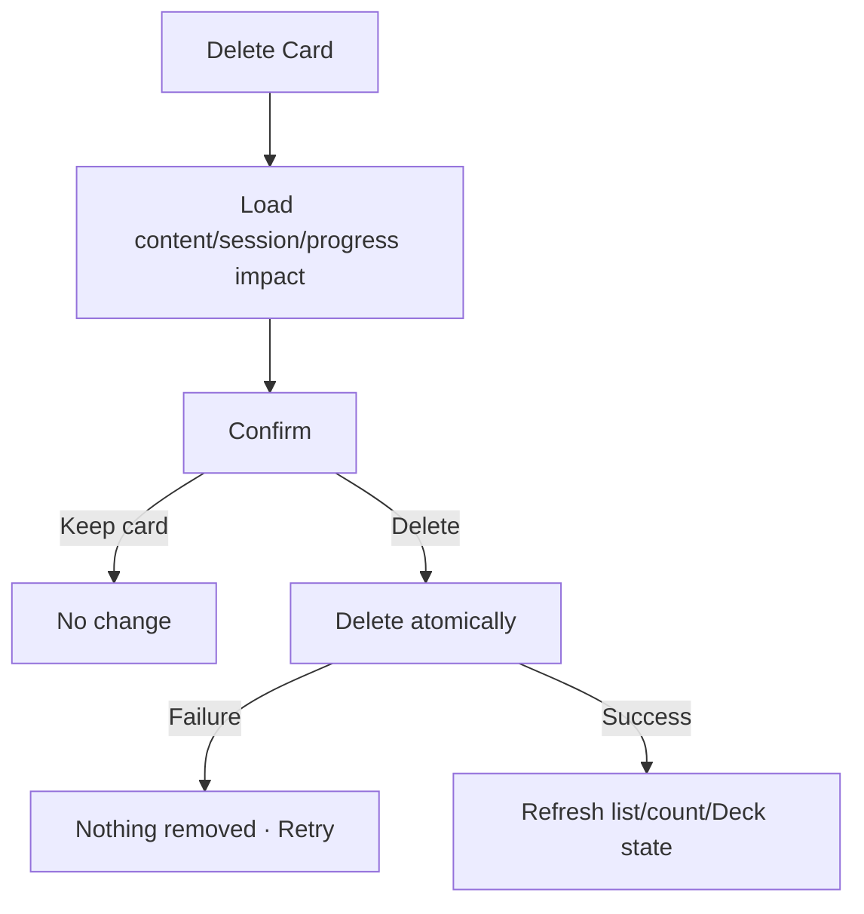

# Đặc tả UI/UX hoàn chỉnh — Delete Flashcard

Flow này permanently deletes Card content và current Progress liên quan. Deck lifecycle and historical reporting effects phải được xử lý atomically/traceably.

## 1. Nguyên tắc đã chốt

- Delete luôn cần explicit confirmation.
- Card content, translations, tags, audio ref và current scheduling state bị xóa cùng transaction.
- Historical finalized Session summaries không bị rewrite; retained Attempt references tuân retention/tombstone policy.
- Card trong active Session cần explicit impact; không silently break current prompt.
- Delete last Card chuyển Leaf → Empty.
- Failure không xóa partial child content/progress.

## 2. Entry points

- Card action → Delete.
- Card detail → Delete.
- Selection mode → Delete selected Cards với count/impact.

# 3. Master flow



# 4. Objective và composition

- Objective: hiểu Card và learning state sẽ mất trước khi xóa.
- Archetype: Destructive confirmation.
- Safe action `Keep card` focus mặc định; destructive `Delete card`.

```text
Delete this card?

“<term>” and its learning progress will be permanently deleted.
Completed session summaries will stay.

Keep card                              Delete card
```

Bulk confirm nêu selected count và active-session intersections.

# 5. Impact decision table

| Condition | Behavior |
| --- | --- |
| No active session | Normal confirm |
| In paused session | Remove/skip from remaining snapshot with traceable reason |
| Current active prompt | Require leave/complete/skip policy before delete commit |
| Already deleted | Idempotent not-found outcome; close safely |
| Last Card in Deck | Deck becomes Empty after success |

# 6. Lifecycle

- Deleting: disable dismiss/Back/double-submit.
- Failure: `Couldn’t delete the card. Nothing has been removed.`
- Success: snackbar `Card deleted`; remove from list/search/queues.
- Audio binary cleanup may be post-commit garbage collection only if Card integrity already resolved and retry-safe.

# 7. Historical/atomic effects

- Delete Card/child content/current Progress.
- Keep finalized aggregate history; Card detail link becomes unavailable/tombstoned per policy.
- Update Deck count/type and active snapshots consistently.
- Rollback on storage failure; no orphan translations/audio refs/progress.

# 8. State matrix

- Single/bulk; with/without Progress; active/paused Session impact.
- Last Card; already deleted; deleting/failure/success.
- Long term/meaning, large count/font, narrow device, light/dark.

# 9. Acceptance criteria

- Confirm states exact impact and safe focus.
- Delete atomic across content/current Progress/Deck count.
- Finalized summaries not rewritten.
- Active Session not silently corrupted.
- Last Card transitions Deck to Empty only after success.
- Deck trở lại Empty không giữ mode Leaf cũ; content đầu tiên tiếp theo quyết định loại mới.
- Delete-confirm canonical state parity dưới 3% mỗi theme.
