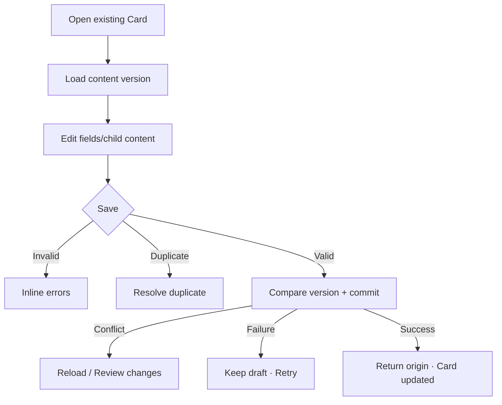

# Đặc tả UI/UX hoàn chỉnh — Edit Flashcard

Flow này cập nhật content của Card đã tồn tại. Nó giữ Card identity, Deck membership và Learning Progress trừ khi user mở Move/Delete flow riêng.

## 1. Nguyên tắc đã chốt

- Edit không reset Progress hoặc Session history.
- Term/meaning vẫn required và revalidate duplicate.
- Changes commit atomically với translations/tags/audio refs.
- Active Session giữ prompt snapshot/version đã start; edit áp dụng cho future prompt/session.
- Save failure giữ draft; concurrent edit không last-write-wins im lặng.
- Move/Hide/Delete không xuất hiện như side effect của Save.

## 2. Entry points

| Context | Trigger |
| --- | --- |
| Card row/action sheet | Edit |
| Card detail | Edit |
| Review browse | Edit; return to same session snapshot policy |
| Search result | Edit; return to Search context |

# 3. Master flow

# 4. Objective, archetype và composition

- Objective: sửa content mà không làm mất identity/progress.
- Archetype: Form; primary CTA `Save`.
- Composition giống Create nhưng title `Edit card` và current values prefilled.
- Deck/Language Pair context hiển thị read-only; Move là action riêng.

# 5. Validation và version rules

- Required/length/normalization dùng cùng contract Create.
- Keeping own normalized content không phải duplicate.
- Duplicate candidate khác Card id mở resolution.
- Save request mang expected content version.
- Concurrent version mismatch giữ draft và nêu fields changed; không overwrite tự động.

# 6. Submit lifecycle

- Clean: Save disabled; Back closes.
- Dirty valid: Save enabled; Back opens discard confirm.
- Submitting: `Saving…`; disable form/Back/double-submit.
- Failure: `Couldn’t update the card. Your changes are still here.`
- Conflict: `This card changed elsewhere. Review the latest version before saving.`
- Success: snackbar `Card updated`; list/search/current origin refresh.

# 7. Cross-object effects

- Card id/Progress/Attempts/Deck count unchanged.
- Audio/translation child changes atomically track Card version.
- Active Session current prompt remains snapshot; optional non-blocking notice may say changes apply next time.
- Search index/projections invalidate after success.

# 8. Not found/offline

- Card deleted before Save → `This card is no longer available.`; no recreate from edit draft without explicit Create.
- Offline edit supported locally; sync conflict handled Account flow later.
- Unknown commit outcome resolves request/version before Retry.

# 9. State matrix

- Edit clean/dirty/validation/duplicate/additional translation/audio.
- Submitting/failure/success/version conflict/not found.
- Keyboard, long multilingual content, large font, narrow device, light/dark.

# 10. Acceptance criteria

- Edit preserves Card id, Deck membership và Progress/history.
- Own content not duplicate; other candidate is reviewed.
- Concurrent edit not overwritten silently.
- Active Session snapshot remains consistent.
- Atomic child-content update and recoverable draft retention.
- Canonical Edit/validation/duplicate states parity dưới 3% mỗi theme.
