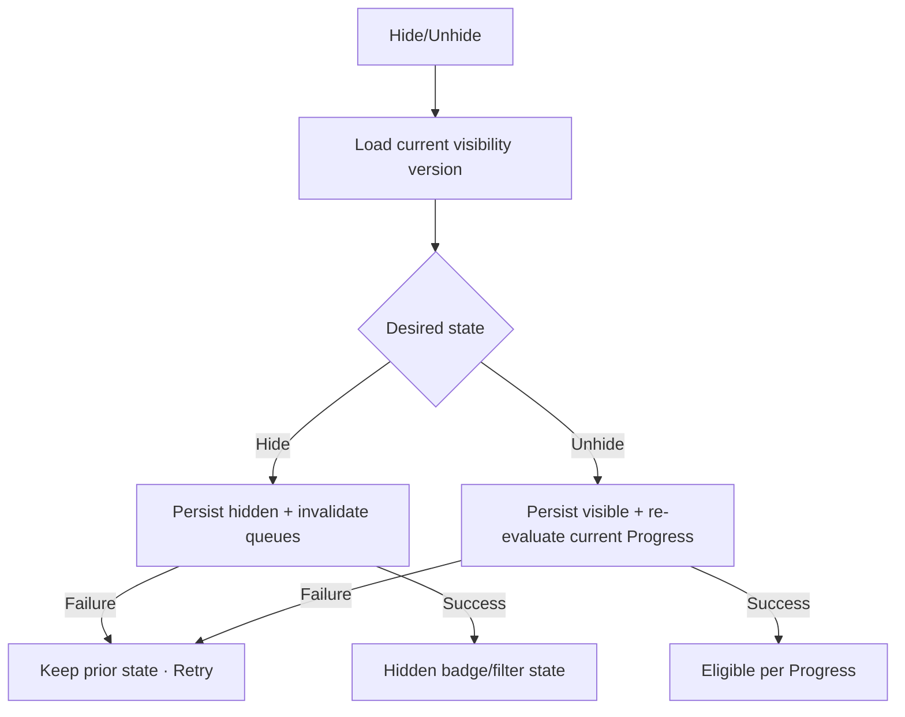

# Đặc tả UI/UX hoàn chỉnh — Hide Flashcard

Flow này ẩn/hiện Card khỏi Study candidate queues mà không xóa content hoặc Progress.

## 1. Nguyên tắc đã chốt

- Hidden Card vẫn tồn tại trong Leaf list và có thể tìm/filter/manage.
- Hidden Card bị loại khỏi new/due/relearn queues cho session mới.
- Hide không reset due/progress/history.
- Unhide khôi phục eligibility theo current Progress, không biến Card thành New.
- Active Session xử lý snapshot rõ; không làm current prompt biến mất đột ngột.
- Toggle idempotent và hỗ trợ offline local-first.

## 2. Entry points

| Context | Action |
| --- | --- |
| Card action sheet/detail | Hide / Unhide |
| Selection mode | Hide/Unhide selected Cards |
| Study browse edit/action | Hide với current-session notice |

# 3. Master flow

# 4. Objective và presentation

- Objective: kiểm soát Study eligibility mà vẫn giữ Card.
- Archetype: Direct list/detail action.
- Single Card toggle không cần destructive confirm; bulk action nêu count.
- Hidden row có semantic label/badge, không chỉ opacity/color.

# 5. Session behavior

- Hide trước Start → Card excluded khi snapshot revalidation.
- Hide Card đang ở active snapshot → current committed flow follows session policy; future queue/session excludes.
- Card đang current prompt không disappear giữa interaction; notice `This card will be hidden from future study.`
- Unhide không thêm vào active snapshot tự động.

# 6. Lifecycle/errors

- Updating: disable same toggle/double-submit.
- Failure: `Couldn’t update this card. Try again.`; retain prior visible state.
- Success: snackbar `Card hidden` / `Card visible`; due counts refresh.
- Concurrent visibility change uses expected version; stale action reloads.

# 7. State matrix

- Visible/hidden; single/bulk; filter hidden only.
- Active-session current/future; updating/failure/conflict/success.
- Offline; long labels, large font, narrow device, light/dark.

# 8. Acceptance criteria

- Hide does not delete/reset content or Progress/history.
- Hidden excluded from fresh candidate queues; Unhide restores per current state.
- Active prompt remains stable; future session behavior clear.
- Toggle/retry idempotent and accessible state not color-only.
- Flashcard list hidden/action states parity dưới 3% mỗi theme.
