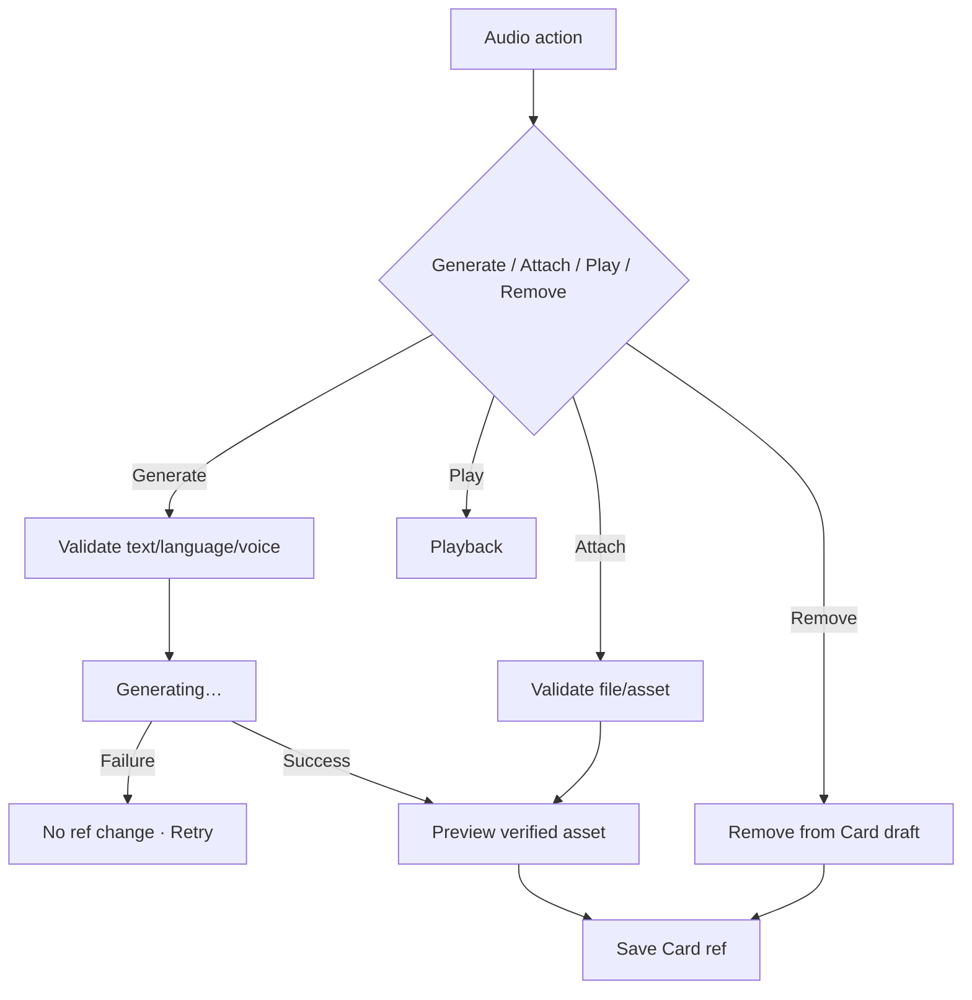

# Đặc tả UI/UX hoàn chỉnh — Manage Card Audio

Flow này sở hữu generate/attach/play/remove audio reference của Card. Audio optional và không thay thế required text content.

## 1. Nguyên tắc đã chốt

- Card có thể Save/Study không có audio.
- Audio ref chỉ persist khi asset generation/attachment hoàn tất và verified.
- Generation request idempotent; retry không tạo orphan/duplicate assets.
- Voice/speed/language context lấy từ effective Preferences/Language Pair.
- Play failure không corrupt Card hoặc block text editing.
- Remove ref atomic với Card version; shared asset cleanup retry-safe.

## 2. Entry points

| Context | Action |
| --- | --- |
| Create/Edit Card | Generate/Attach audio |
| Existing audio row | Play/Regenerate/Remove |
| Study prompt | Play existing audio only; edit opens Card flow |

# 3. Master flow



# 4. Objective, archetype và composition

- Objective: thêm hoặc quản lý phát âm hỗ trợ mà không cản content save.
- Archetype: Nested form/action row.
- Card Editor giữ primary CTA `Save`; audio actions secondary.

```text
Audio
<voice/language>                                  Play

Generate audio        Attach file        Remove
```

# 5. Generation/attachment rules

- Missing/blank source text: `Add the term before generating audio.`
- Unsupported language/voice: nêu recovery chọn voice hoặc attach file.
- Attached asset phải readable và supported; invalid file không persist ref.
- Regenerate giữ current audio cho đến khi replacement verified.
- Save while generating: chờ/cancel generation hoặc explicit Save without pending audio; không persist pending ref.

# 6. Lifecycle

- Generating: progress/status, disable duplicate generation; text edit policy rõ để tránh asset/text mismatch.
- Generation failure: `Couldn’t generate audio. Your card text is still here.`
- Playback loading/error không đổi draft.
- Remove tồn tại trong parent draft; discard restores prior ref.
- Card Save failure giữ verified pending asset reference/draft và Retry.

# 7. Concurrency/storage cleanup

- Card version mismatch không attach asset vào stale content silently.
- Abandoned generated asset được garbage-collect retry-safe.
- Shared/cached asset chỉ delete physical file khi không còn reference.
- Offline generation unavailable có Attach/Save without audio recovery khi phù hợp.

# 8. Cross-object effects

- Active Session snapshot giữ audio ref/version current at Start.
- Preferences change áp dụng generation/playback request mới, không rewrite asset cũ.
- Progress/Deck count unchanged.

# 9. State matrix

- No audio; existing; generating; preview; generation failure.
- Attach valid/invalid; playback loading/error; regenerate; remove.
- Save while generating; version conflict; offline.
- Long voice/language labels, large font, narrow device, light/dark.

# 10. Acceptance criteria

- Pending/failed asset không persist ref.
- Audio optional; failure không mất Card draft.
- Regenerate không xóa working audio trước verified replacement.
- Retry/version handling không create orphan/duplicate refs.
- Active Session snapshot consistent; Progress/content text unaffected.
- Audio-generating Editor state parity dưới 3% mỗi theme.
