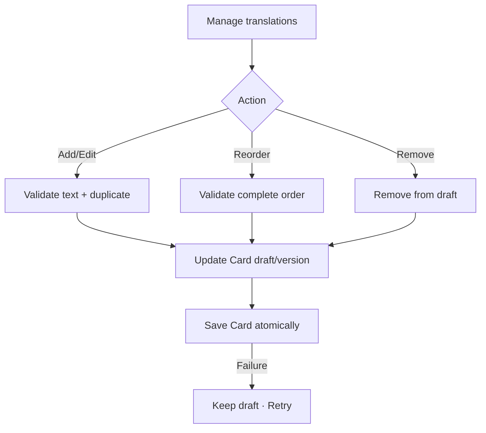

# Đặc tả UI/UX hoàn chỉnh — Manage Card Translations

Flow này sở hữu additional meanings/translations của một Card. Primary meaning vẫn là required field của Create/Edit.

## 1. Nguyên tắc đã chốt

- Primary meaning không thể bị xóa qua additional-translation controls.
- Additional translation có stable identity và explicit order.
- Blank translation không được persist.
- Normalized duplicate của primary/another translation bị chặn hoặc yêu cầu sửa.
- Add/edit/reorder/remove commit cùng Card content version.
- Active Session dùng content snapshot; changes áp dụng future prompt/session.

## 2. Entry points

- Create/Edit Card → `Add translation`.
- Existing additional translation → Edit/Remove/Reorder.
- Import mapping → translated child values sau validation semantics này.

# 3. Master flow



# 4. Objective, archetype và composition

- Objective: bổ sung meanings mà không làm mơ hồ primary meaning.
- Archetype: Nested form section trong Card Editor.
- Card Editor vẫn có một primary CTA `Save`; child rows không tạo competing primary.

```text
Additional translations

[ 1  Nghĩa bổ sung                               More ]
[ 2  Another meaning                            More ]

Add translation
```

# 5. Field/order rules

- Text trim outer whitespace; preserve intentional internal line breaks.
- Empty: `Add a translation.`
- Too long: `Use a shorter translation.`
- Duplicate: `This translation is already on the card.`
- Order positions contiguous/unique after Save.
- Reorder uses accessible move actions in addition to gesture when applicable.

# 6. Lifecycle và cancel

- Child edits live in parent Card draft until Save.
- Removing existing translation can be undone by discard parent draft.
- Save submitting/error/success follows Create/Edit contract.
- Concurrent Card version conflict shows latest translations; no silent overwrite.
- App background preserves parent draft.

# 7. Cross-object effects

- Search index invalidates after success.
- Progress/Deck membership/count unchanged.
- Active Session snapshot remains current; future prompts use new ordered set.
- Removing audio/primary meaning is outside this flow.

# 8. State matrix

- None/one/dense translations; add/edit/remove/reorder.
- Empty/too-long/duplicate; concurrent conflict; submitting/failure/success.
- Long multilingual/RTL text, keyboard, large font, narrow, light/dark.

# 9. Acceptance criteria

- Primary meaning protected; additional entries nonblank/unique/ordered.
- Child edits atomic with Card version and retained through failure.
- Reorder accessible without gesture-only dependency.
- Progress/membership unchanged; active snapshot consistent.
- Additional-translation Editor state parity dưới 3% mỗi theme.
