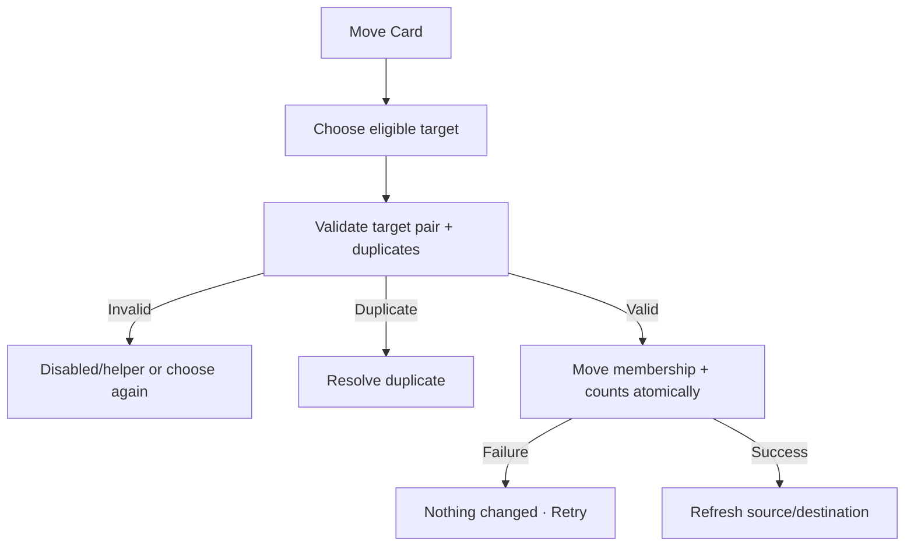

# Đặc tả UI/UX hoàn chỉnh — Move Flashcard

Flow này di chuyển Card tới eligible Empty/Leaf Deck. Deck target picker sở hữu eligibility presentation; Flashcard sở hữu atomic membership update.

## 1. Nguyên tắc đã chốt

- Target không được là Parent hoặc source Deck hiện tại.
- Move giữ Card id, content, translations, audio, current Progress và Attempt linkage.
- Language Pair khác cần explicit compatibility review; không dịch content tự động.
- Duplicate check chạy trong target context.
- Source/Destination Deck transitions atomic.
- Active Session snapshot không đổi scope giữa chừng; future sessions dùng destination mới.

## 2. Entry points

- Card action → Move.
- Card detail → Move.
- Selection mode → Move selected Cards khi cùng decision boundary hợp lệ.

# 3. Master flow

# 4. Objective và composition

- Objective: chọn Deck mới mà không mất content/progress.
- Archetype: Selection.
- Parent disabled helper `Choose one of its nested decks.`
- Target row hiển thị path, Language Pair và card count.
- Primary CTA `Move here` sau valid selection.

# 5. Decision table

| Target | Result |
| --- | --- |
| Empty same pair | Allowed; target → Leaf |
| Leaf same pair | Allowed |
| Parent | Disabled |
| Source Deck | Disabled `Already here` |
| Different pair | Review language mismatch; explicit continue/cancel |
| Duplicate candidate | Duplicate resolution before commit |
| Deleted/stale | Reload picker |

# 6. Submit lifecycle

- Moving: disable picker/Back/double-submit.
- Failure: `Couldn’t move the card. Nothing has changed.`; giữ target.
- Success: snackbar `Card moved`; source list removes row; optional `Open deck` action.
- Không tự mở destination hoặc reset Progress.

# 7. Atomic effects

- Update Card membership.
- Source count--, destination count++.
- Source loses last Card → Empty.
- Destination Empty → Leaf.
- Source trở lại Empty không giữ mode Leaf cũ; content đầu tiên tiếp theo quyết định loại mới.
- Search indexes/projections invalidate.
- Failure rollback all counts/membership.

# 8. State matrix

- Picker shallow/deep/search; valid Empty/Leaf; Parent/source disabled.
- Pair mismatch; duplicate; stale target; moving/failure/success.
- Bulk minimum/dense; long paths/pairs, large font, narrow, light/dark.

# 9. Acceptance criteria

- Parent/source never accepted.
- Move preserves identity/content/progress/history.
- Source/destination transitions and counts atomic.
- Move không được tạo mixed content; target Empty chỉ thành Leaf sau commit thành công.
- Active Session snapshot remains consistent.
- Retry creates one membership result.
- Target-picker canonical states parity dưới 3% mỗi theme.
