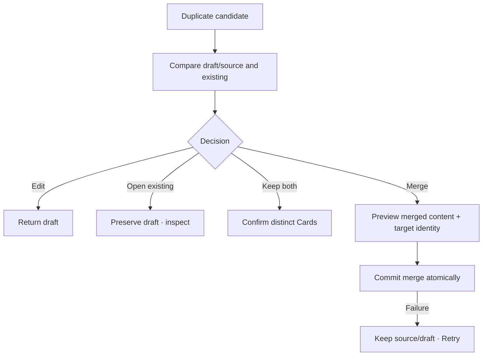

# Đặc tả UI/UX hoàn chỉnh — Resolve Duplicate Flashcard

Flow này sở hữu review và decision khi Create/Edit phát hiện exact hoặc possible duplicate. Detection không tự mutate content.

## 1. Nguyên tắc đã chốt

- Candidate dựa normalized content + Language Pair/scope policy, không chỉ raw string.
- Exact và possible match phải phân biệt.
- Draft/current input luôn giữ trong lúc review.
- Không auto-merge, auto-delete hoặc auto-overwrite.
- `Keep both` là explicit decision được audit cùng save request.
- Merge bảo toàn target identity/progress; source handling phải rõ và atomic.

## 2. Entry cases

| Origin | Candidate | Available decisions |
| --- | --- | --- |
| Create draft | Existing Card | Edit draft, open existing, keep both, merge draft fields |
| Edit Card | Another Card | Continue editing, keep both, review merge |
| Import | Existing Card(s) | Import-owned batch decision dẫn chiếu semantics này |

# 3. Master flow



# 4. Objective, archetype và composition

- Objective: tránh duplicate không chủ ý mà không chặn duplicate có chủ đích.
- Archetype: Review/decision banner + detail.
- Primary action phụ thuộc origin; không có hai primary actions cạnh tranh.

```text
This card may already exist

New / edited card                    Existing card
<term · meaning>                     <term · meaning>

Review the differences before saving.
```

# 5. Decision semantics

- Edit: no mutation; return focus to differing field.
- Open existing: draft retained until explicit discard/return.
- Keep both: persists separate id/progress; duplicate acknowledgement stored for request.
- Merge create draft: merge optional fields into existing; existing current Progress remains.
- Merge two persisted Cards: explicit target; target Progress remains current; source history remains traceable; source removal only after full impact confirm.
- Conflicting primary term/meaning requires user choice; no concatenation guess.

# 6. Lifecycle/errors

- Loading candidate failure returns draft with `Couldn’t check for duplicates. Try again.`; policy decides whether save can continue only with explicit warning.
- Merge submitting disables actions/double-submit.
- Merge failure: `Couldn’t merge the cards. Nothing has changed.`
- Candidate changed/deleted → refresh comparison.
- Keep-both retry creates at most one new Card.

# 7. State matrix

- Exact/possible; Create/Edit/Import origins.
- Compare long text/translations/audio/tags.
- Keep-both confirm; merge preview/submitting/failure/success.
- Candidate stale/not found; large font, narrow device, light/dark.

# 8. Acceptance criteria

- Detection never mutates automatically.
- Draft retained through review/error/open-existing round trip.
- Keep both explicit and idempotent.
- Merge target/progress/history impact clear and atomic.
- Primary content conflicts require user decision.
- Duplicate canonical Editor state parity dưới 3% mỗi theme.
