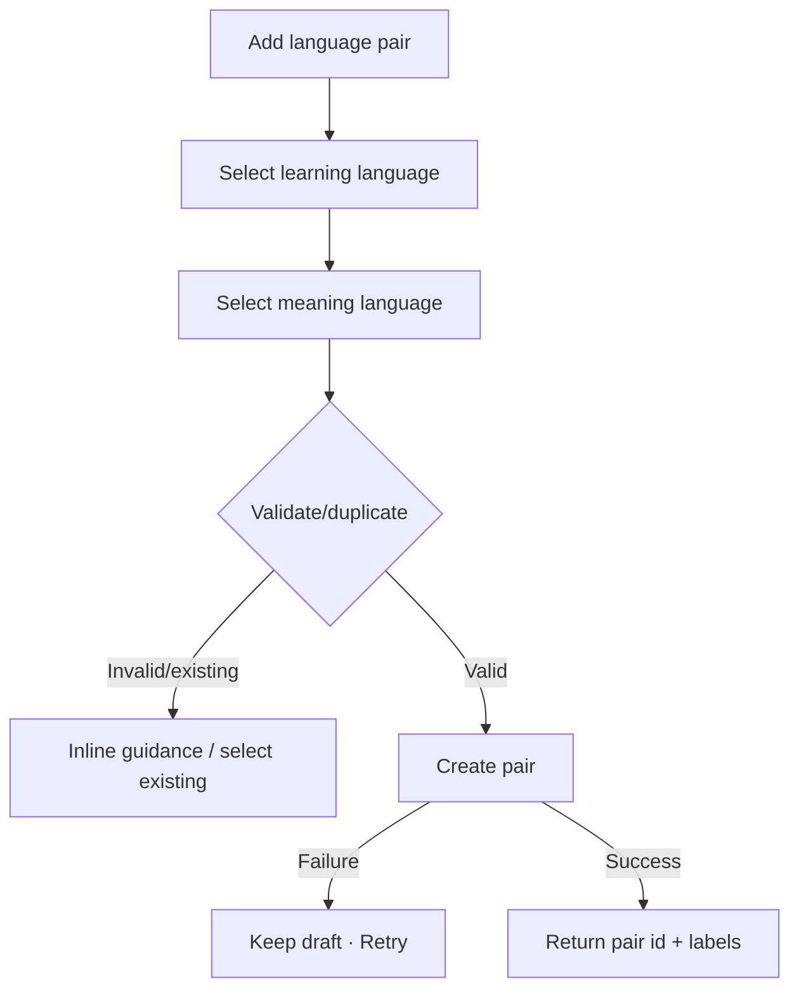

# Đặc tả UI/UX hoàn chỉnh — Create Language Pair

Flow này tạo learning/meaning language context từ Settings hoặc first-run Create Deck.

## 1. Nguyên tắc đã chốt

- Learning language và meaning language đều bắt buộc.
- Pair identity ổn định; label chỉ là presentation.
- Duplicate pair theo normalized language ids không được tạo âm thầm.
- Tạo Pair không tự tạo Deck trừ orchestration first-run đã xác nhận.
- Save failure giữ selections/draft.

## 2. Master flow

## 3. Objective và composition

- Objective: tạo một context ngôn ngữ dùng được cho Deck.
- Archetype: Two-step selection/form.
- Primary CTA: `Add language pair`.
- Pickers hỗ trợ search và tên ngôn ngữ dài; selected values không ellipsis phần phân biệt.

## 4. Lifecycle

- Save disabled khi thiếu một selection.
- Existing pair đưa lựa chọn dùng pair hiện có, không duplicate.
- Double-submit/retry tạo tối đa một Pair.
- First-run success trả control về Create Deck orchestration.

## 5. State matrix

- Empty/one/both selected, same language if disallowed, duplicate.
- Saving/failure/success, long names, search no-result.
- Keyboard, large font, narrow, light/dark.

## 6. Acceptance criteria

- Pair chỉ tạo khi hai language ids hợp lệ.
- Duplicate được resolve rõ.
- Retry idempotent và giữ draft.
- Create Pair không mutate Card hoặc tự dịch content.
