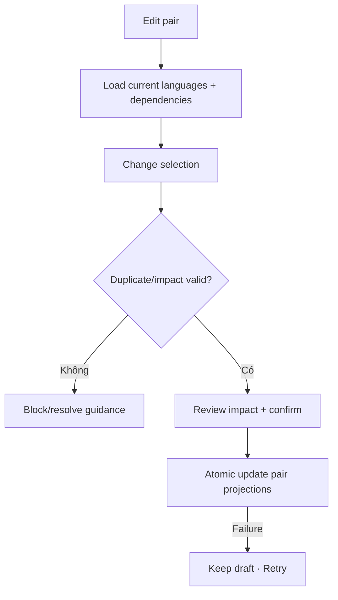

# Đặc tả UI/UX hoàn chỉnh — Edit Language Pair

Flow này thay đổi languages của Pair sau khi review Deck dependencies và ảnh hưởng presentation.

## 1. Nguyên tắc đã chốt

- Identity Pair giữ ổn định khi edit.
- Dependency summary bắt buộc nếu Pair đang được Deck sử dụng.
- Nested subtree vẫn không được mixed pair.
- Flashcard text giữ nguyên; không auto-translate/relabel content.
- Edit không được merge hai Pair im lặng khi trùng target pair.

## 2. Master flow

## 3. Objective và composition

- Objective: cập nhật Pair mà người học hiểu Deck nào bị ảnh hưởng.
- Archetype: Edit form + impact confirmation.
- Primary CTA: `Save changes`; impact summary trước confirm.

## 4. Lifecycle

- Unchanged Save disabled.
- Dependency changes trong submit buộc revalidation.
- Duplicate destination Pair chuyển sang decision flow, không auto-merge.
- Success refresh labels/path consumers; Card text không đổi.

## 5. State matrix

- No dependency/one/many/deep subtree.
- Unchanged, duplicate, submitting/failure/success, stale dependency.
- Long language/Deck names, large font, narrow, light/dark.

## 6. Acceptance criteria

- Edit giữ Pair identity và hierarchy invariant.
- User thấy dependency impact trước commit.
- Không auto-translate hoặc auto-merge.
- Failure giữ prior persisted Pair và draft.
